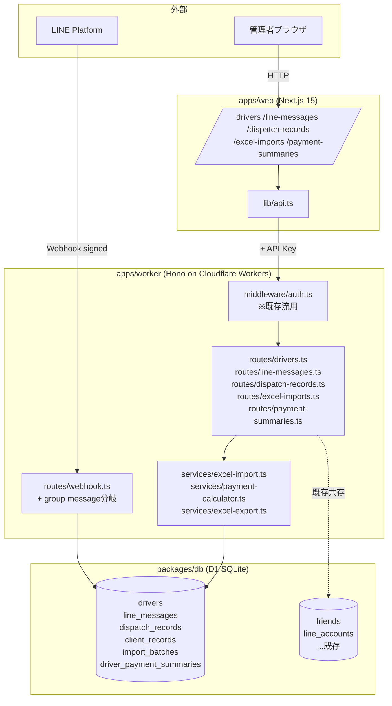
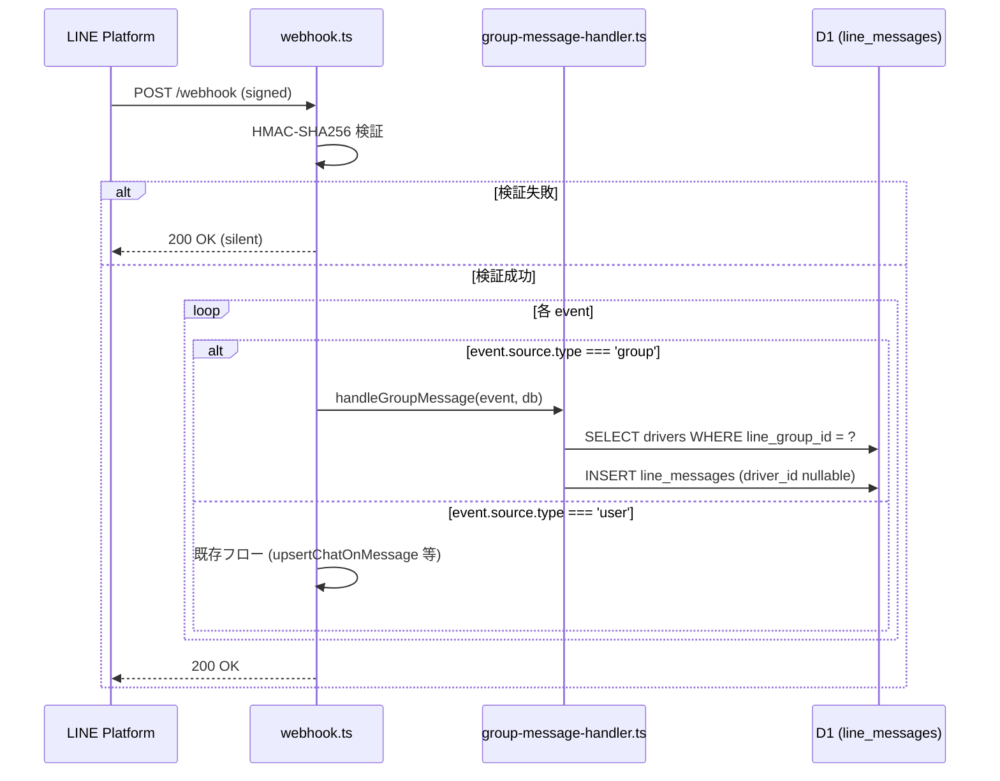
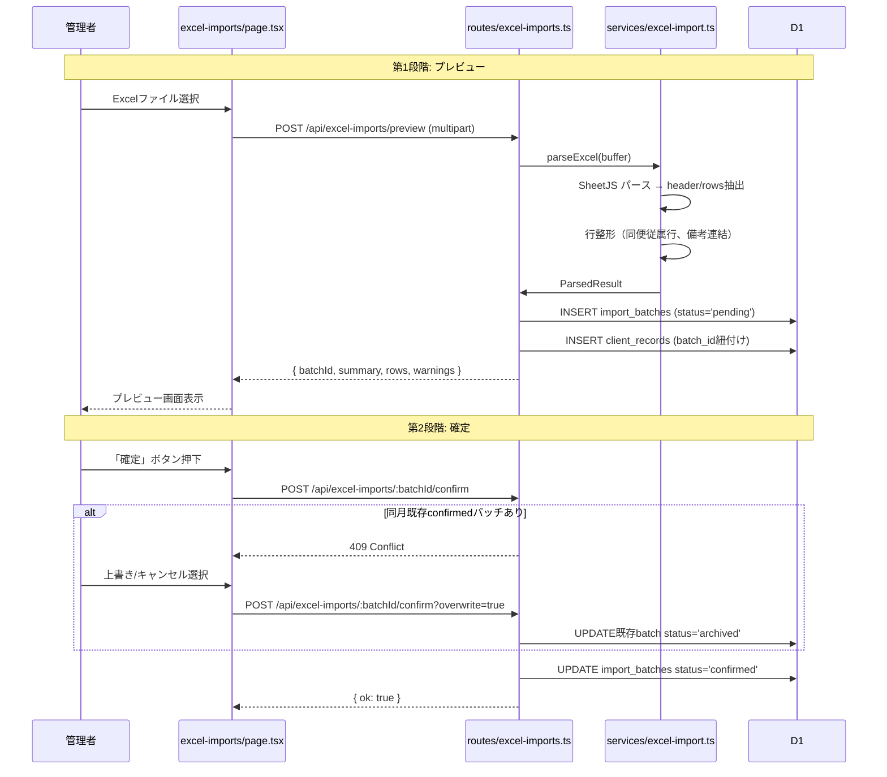
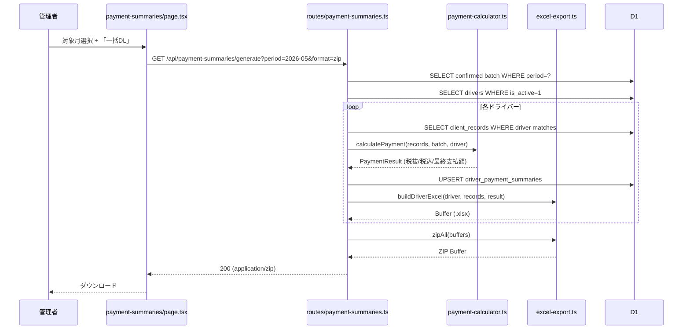
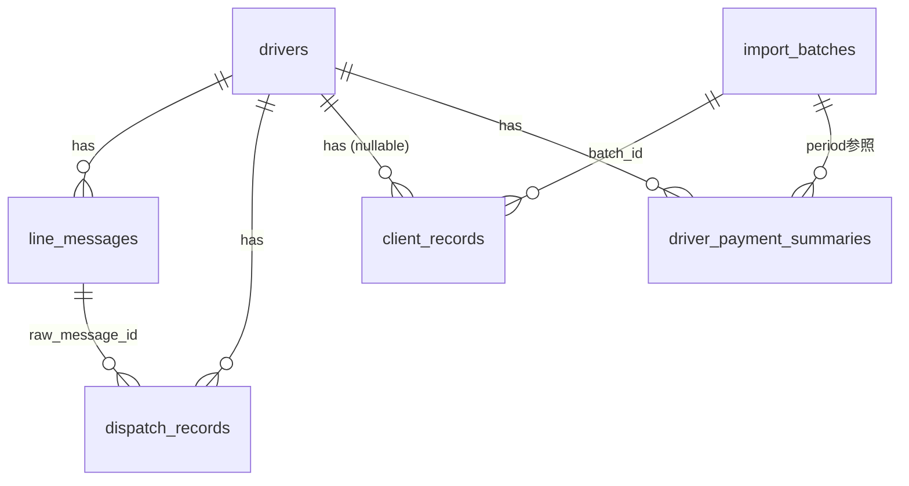

# Design Document — Phase 1 MVP

## Overview

**Purpose**: STEELO 稼働照合・ドライバー支払明細システムの Phase 1 MVP として、
LINE配車メッセージの自動蓄積（F1）、元請けBOND'sの支払明細Excelインポート（F3）、
管理画面の基本CRUD（F5）、ドライバー別支払明細Excelの自動生成（F6）を実現する。

**Users**: STEELO代表（管理者1名）が管理画面を介して照合準備データを整え、
月次の支払明細を生成する。ドライバー約20名は本システムを直接使わず、
従来通りLINEで配車を受信・完了報告する。

**Impact**: 既存LINE Harnessリポジトリに対し、運送業ドメインの新規テーブル
（`drivers`, `line_messages`, `dispatch_records`, `client_records`, `import_batches`,
`driver_payment_summaries`）と、それを操作する新規ルート/サービス/管理画面を**加算的に**
追加する。既存の友だち/シナリオ/broadcast機能は無変更で共存する。

### Goals

- LINEグループメッセージを欠落なく自動蓄積（Webhook 3秒以内応答）
- BOND's Excel（ヘッダー+明細部）を2段階インポート（プレビュー→確定）で
  誤投入を防止
- ドライバー支払明細の計算ロジック（手数料控除 → インボイス分岐 → 四捨五入）を
  数式レベルで決定論的に実装
- 単月20名分の一括Excel生成を60秒以内に完了
- 既存LINE Harnessの設計パターン（routes/services/db分離、共有型、snake↔camel変換）に準拠

### Non-Goals

- Claude Haiku によるメッセージ自動解析（F2、Phase 2）
- 配車レコードと元請けレコードの自動マッチング（F4、Phase 2）
- 照合結果画面・差分レポート（Phase 2）
- 異常値検出・学習データ蓄積（Phase 3）
- 既存LINE Harnessの友だち/シナリオ/broadcast機能の変更

## Boundary Commitments

### This Spec Owns

- ドライバーマスタ（`drivers`）の管理
- LINEグループメッセージの受信・蓄積（`line_messages`）
- 配車レコードの手動CRUD（`dispatch_records`、Phase 1は手動入力）
- BOND's Excelインポートとパース処理（`import_batches`, `client_records`）
- ドライバー支払明細の計算・Excel生成（`driver_payment_summaries`）
- 管理画面の新規ページ群とナビゲーション項目追加

### Out of Boundary

- LINE個別チャット（ドライバー個人とのDM）は本Spec対象外（既存LINE Harnessの
  `chats`/`messages_log` がカバー）
- 配車メッセージの自動解析（Phase 2 で `services/dispatch-parser.ts` を追加予定）
- 自動照合エンジン（Phase 2 で `services/reconciliation.ts` を追加予定）
- 既存LINE Harnessのテーブル（`friends`, `scenarios`, `broadcasts` 等）の変更
- 認証機構自体（既存APIキー認証 + `auth-guard.tsx` を流用）

### Allowed Dependencies

- `@line-crm/line-sdk`: LINE Messaging API クライアント、Webhook 署名検証
- `@line-crm/db`: 既存D1ヘルパー（`getLineAccounts`, `jstNow` 等）
- `@line-crm/shared`: 既存共有型（必要に応じ拡張）
- `xlsx` (SheetJS): Excel読み書き（Phase 1で新規導入）
- `jszip`: ZIP生成（Phase 1で新規導入）

### Revalidation Triggers

以下が変わると Phase 2 の照合エンジン設計に影響するため再検証が必要:

- `dispatch_records` または `client_records` のスキーマ変更
- ドライバー紐付けキー（`drivers.line_group_id`, `drivers.name`）の変更
- 元請けExcelのレイアウト変更（BOND'sのフォーマット変更）
- 支払計算式の変更（手数料率、消費税率、インボイス分岐ロジック）

## Architecture

### Existing Architecture Analysis

LINE Harness の基本設計は以下:

- **`apps/worker/src/index.ts`**: 60+ ルートを `app.route('/api/...', xxx)` でマウントする
  集約ポイント。Cron トリガーも `scheduled()` ハンドラで定義
- **`apps/worker/src/routes/webhook.ts`**: LINE Webhook受信。`message` イベントは
  `upsertChatOnMessage()` で個別チャット保存、`friend_add` は `upsertFriend()` で友だち登録。
  グループメッセージは現状ハンドリングされていない（個別チャットのみ前提）
- **`apps/worker/src/middleware/auth.ts`**: APIキー認証（`/webhook`, `/auth/`, `/liff/` は除外）
- **`packages/db/src/*.ts`**: ドメイン別のクエリ関数群。`db: D1Database` を引数で受ける純粋関数
- **`apps/web/src/app/<feature>/page.tsx`**: Next.js 15 App Router の規約に従う。
  `components/app-shell.tsx` がナビゲーション。`lib/api.ts` がWorker API呼び出しwrapper

本Phaseはこのパターンを踏襲して **加算** する。

### Architecture Pattern & Boundary Map



**Architecture Integration**:
- 選択パターン: **既存モノレポの加算拡張**。LINE Harnessの「Hono routes → services →
  @line-crm/db クエリ関数 → D1」の層構造をそのまま使う
- ドメイン境界: 運送業向けの新ドメイン（`drivers`, `dispatch_records`, `client_records`,
  `import_batches`, `payment_summaries`）を1ファイル1ドメインで分離
- 既存パターン保持: API key認証、`@line-crm/shared` 型集約、JST timestamp、UUID PK
- 新規コンポーネントの根拠:
  - Excel処理は重い処理になりうるためサービス層に分離（routes は薄く保つ）
  - 計算ロジック（`payment-calculator.ts`）は純粋関数化してユニットテストしやすくする
- steering準拠: `structure.md` の「新しいドメインを追加する手順」をそのまま適用

### Technology Stack

| Layer | Choice / Version | Role in Feature | Notes |
|-------|------------------|-----------------|-------|
| Frontend | Next.js 15 (App Router) + React 19 | 管理画面の新規ページ群 | 既存 `app-shell` にメニュー追加 |
| API | Hono on Cloudflare Workers | 新規 5 ルートファイル | 既存`index.ts`にマウント |
| DB | Cloudflare D1 (SQLite) | 新規6テーブル | migration `046_steelo_phase1.sql` で追加 |
| Excel I/O | xlsx (SheetJS) ^0.20 | Excelパース・生成 | Workers ESM build を使用 |
| ZIP | jszip ^3.10 | 一括DL時のZIP圧縮 | Workersで動作確認済み |
| LINE | @line-crm/line-sdk (内部) | Webhook受信・署名検証 | 既存ライブラリ流用、新規API不要 |
| Storage | D1 のみ | Excelファイル本体は保存しない | パース結果のみDB保存。R2は未使用 |
| Auth | 既存 middleware/auth.ts | 全新規ルート保護 | `/api/dispatch/webhook-group` のみ署名検証 |

Excel生成時のメモリは Cloudflare Workers の 128MB制限内に収まる
（月1000件 × 数KB ≈ 数MB）。SheetJS のESM buildを使い、`vite-plugin-node-polyfills`
は不要。

## File Structure Plan

### Directory Structure

```
apps/worker/src/
├── routes/
│   ├── webhook.ts                # ★既存。group message分岐を追加（拡張）
│   ├── drivers.ts                # ★新規。ドライバーマスタCRUD
│   ├── line-messages.ts          # ★新規。LINEメッセージ閲覧API
│   ├── dispatch-records.ts       # ★新規。配車レコードCRUD
│   ├── excel-imports.ts          # ★新規。Excelアップロード・確定
│   └── payment-summaries.ts      # ★新規。支払明細生成・DL
├── services/
│   ├── group-message-handler.ts  # ★新規。group message受信処理
│   ├── excel-import.ts           # ★新規。SheetJSパース・行解析
│   ├── payment-calculator.ts     # ★新規。純粋関数の支払計算
│   └── excel-export.ts           # ★新規。明細Excel生成・ZIP化
└── index.ts                      # ★既存。新規ルート5つをマウント

packages/db/
├── migrations/
│   └── 046_steelo_phase1.sql     # ★新規。6テーブル追加
├── schema.sql                    # ★既存。046の内容を反映
└── src/
    ├── drivers.ts                # ★新規。ドライバークエリ
    ├── line-messages.ts          # ★新規。LINEメッセージクエリ
    ├── dispatch-records.ts       # ★新規。配車レコードクエリ
    ├── client-records.ts         # ★新規。元請けレコードクエリ
    ├── import-batches.ts         # ★新規。インポート履歴クエリ
    └── payment-summaries.ts      # ★新規。支払サマリークエリ

packages/shared/src/
└── types.ts                      # ★既存。STEELO関連型を追記

apps/web/src/
├── app/
│   ├── drivers/page.tsx          # ★新規。ドライバーマスタ一覧・編集
│   ├── line-messages/page.tsx    # ★新規。LINEメッセージ閲覧
│   ├── dispatch-records/page.tsx # ★新規。配車レコード一覧・編集
│   ├── excel-imports/page.tsx    # ★新規。Excelアップロード・確定
│   └── payment-summaries/page.tsx # ★新規。支払明細生成・DL
├── components/
│   ├── app-shell.tsx             # ★既存。メニュー項目追加
│   ├── drivers/driver-form.tsx   # ★新規
│   ├── excel-imports/import-preview.tsx # ★新規
│   └── payment-summaries/generate-form.tsx # ★新規
└── lib/
    └── api.ts                    # ★既存。新規エンドポイント関数追記
```

### Modified Files

- `apps/worker/src/routes/webhook.ts`: group メッセージ判定の分岐を追加。
  個別チャットフロー（`upsertChatOnMessage`）の手前で `source.type === 'group'`
  なら `handleGroupMessage()` を呼ぶ
- `apps/worker/src/index.ts`: 新規5ルートを `app.route('/api/...', xxx)` でマウント
- `apps/web/src/components/app-shell.tsx`: ナビゲーションに5項目追加
- `apps/web/src/lib/api.ts`: 新規エンドポイントの呼び出し関数追記
- `packages/shared/src/types.ts`: `Driver`, `LineMessage`, `DispatchRecord`,
  `ClientRecord`, `ImportBatch`, `DriverPaymentSummary` 型を追加
- `packages/db/schema.sql`: migration 046 の内容を反映（fresh deploy用）

## System Flows

### F1 グループメッセージ受信フロー



**ポイント**: 既存の friend/scenario 関連処理は group 経由では呼ばない。
LINEのWebhook 1分タイムアウト制約があるが、`line_messages` への単純INSERTのみで
3秒以内応答可能。

### F3 Excelインポートフロー（2段階）



### F6 支払明細一括生成フロー



**ポイント**: 計算は純粋関数 `calculatePayment` に集約しユニットテスト可能にする。
Workers の128MBメモリ制限内に収めるため、ドライバー単位で逐次処理（並列化しない）。
60秒のCPU制限内には十分収まる想定（20ドライバー × 数百件 × Excel生成 ≈ 数秒）。

## Requirements Traceability

| Requirement | Summary | Components | Interfaces | Flows |
|-------------|---------|------------|------------|-------|
| 1.1〜1.6 | LINE グループメッセージ受信・蓄積 | webhook.ts (拡張), group-message-handler.ts, drivers.ts (query), line-messages.ts (query) | POST /webhook | F1 受信フロー |
| 2.1〜2.5 | ドライバーマスタCRUD | routes/drivers.ts, packages/db/src/drivers.ts, drivers/page.tsx, drivers/driver-form.tsx | GET/POST/PATCH/DELETE /api/drivers | — |
| 3.1〜3.7 | 元請けExcelインポート | excel-imports.ts (route), excel-import.ts (service), client-records.ts (query), import-batches.ts (query) | POST /api/excel-imports/preview, POST /api/excel-imports/:id/confirm | F3 インポートフロー |
| 4.1〜4.6 | LINEメッセージ・配車レコード閲覧 | line-messages.ts (route), dispatch-records.ts (route), line-messages/page.tsx, dispatch-records/page.tsx | GET /api/line-messages, GET/POST/PATCH /api/dispatch-records | — |
| 5.1〜5.9 | 支払明細Excel生成 | payment-summaries.ts (route), payment-calculator.ts (service), excel-export.ts (service), payment-summaries.ts (query) | GET /api/payment-summaries/generate | F6 生成フロー |
| 6.1〜6.4 | 認証・基本UI | 既存 middleware/auth.ts, app-shell.tsx (拡張), 各 page.tsx | — | — |
| 7.1〜7.5 | データ整合性・非機能 | DB schema design, payment-calculator.ts (Math.round), 全ルートのエラーハンドリング | — | — |

## Components and Interfaces

| Component | Domain/Layer | Intent | Req Coverage | Key Dependencies | Contracts |
|-----------|--------------|--------|--------------|------------------|-----------|
| webhook.ts (拡張) | Worker / Routes | グループメッセージ分岐 | 1.1〜1.6 | group-message-handler, line-sdk (P0) | API |
| group-message-handler.ts | Worker / Services | グループ受信処理 | 1.1〜1.6 | drivers query, line-messages query (P0) | Service |
| drivers.ts (route+query) | Worker / Routes+DB | ドライバーマスタCRUD | 2.1〜2.5 | D1 (P0) | API, Service |
| excel-imports.ts | Worker / Routes | Excelアップロード・確定API | 3.1〜3.7 | excel-import service, client-records query (P0) | API |
| excel-import.ts | Worker / Services | SheetJSでパース・整形 | 3.1〜3.7 | xlsx (P0) | Service |
| payment-calculator.ts | Worker / Services | 支払計算（純粋関数） | 5.1〜5.9, 7.1 | — | Service |
| excel-export.ts | Worker / Services | 明細Excel生成・ZIP化 | 5.1〜5.9 | xlsx, jszip (P0) | Service |
| payment-summaries.ts | Worker / Routes+DB | 生成API・DL | 5.1〜5.9 | calculator, exporter, all queries (P0) | API |
| drivers/page.tsx | Web / UI | ドライバーマスタ画面 | 2.1〜2.5 | api.ts (P0) | UI |
| excel-imports/page.tsx | Web / UI | アップロード・プレビュー画面 | 3.1〜3.7 | api.ts (P0) | UI |
| payment-summaries/page.tsx | Web / UI | 支払明細生成画面 | 5.1〜5.9 | api.ts (P0) | UI |

### Worker / Services

#### group-message-handler.ts

| Field | Detail |
|-------|--------|
| Intent | LINEグループ送信メッセージを受け取り `line_messages` に蓄積する |
| Requirements | 1.1, 1.2, 1.3, 1.5 |

**Responsibilities & Constraints**
- 受信eventごとに driver 紐付けを試行（`drivers.line_group_id` 一致で `driver_id` 確定）
- バイナリ系（image/file/video/audio）はメタデータのみ保存
- 既存の友だち/シナリオ処理は呼ばない

**Dependencies**
- Inbound: webhook.ts (P0)
- Outbound: `@line-crm/db` の `getDriverByLineGroupId`, `insertLineMessage` (P0)

**Contracts**: Service [x]

```typescript
interface GroupMessageHandler {
  handleGroupMessage(
    event: WebhookEvent & { source: { type: 'group'; groupId: string } },
    db: D1Database
  ): Promise<void>
}
```

- Preconditions: event は LINE 署名検証済み、source.type === 'group'
- Postconditions: `line_messages` に 1 行 INSERT、driver_id は一致あれば設定、なければ NULL
- Invariants: 既存 friends/chats テーブルには書き込まない

#### excel-import.ts

| Field | Detail |
|-------|--------|
| Intent | アップロードされたBOND's Excelをパースし、ヘッダーと明細行を構造化データに変換 |
| Requirements | 3.1, 3.2, 3.3, 3.4 |

**Responsibilities & Constraints**
- ヘッダー部から運賃合計/立替/控除項目/対象月を抽出
- 明細部の同便従属行（運賃が `-`）は `fare = NULL` でスルー
- 連続する空メイン行の備考は直前行に連結

**Dependencies**
- Outbound: `xlsx` パッケージ (P0)

**Contracts**: Service [x]

```typescript
type ParsedExcel = {
  header: {
    period: string              // "2026-05"
    totalFare: number           // 税抜
    totalAdvance: number
    vehicleCost: number
    processingFee: number
    prepayment: number
    commissionRate: number      // 0.075 既定
  }
  rows: ParsedRow[]
  warnings: string[]
}

type ParsedRow = {
  workDay: number               // 1-31
  dayOfWeek: string
  taskName: string | null
  pickupLocation: string | null
  deliveryLocation: string | null
  startTime: string | null
  endTime: string | null
  distanceKm: number | null
  advancePayment: number        // 円
  fare: number | null           // 円、null=同便従属行
  driverName: string | null
  notes: string | null
}

interface ExcelImporter {
  parseExcel(buffer: ArrayBuffer): ParsedExcel
}
```

#### payment-calculator.ts

| Field | Detail |
|-------|--------|
| Intent | 単一ドライバーの月次支払額を確定論的に計算する純粋関数群 |
| Requirements | 5.1〜5.9, 7.1 |

**Responsibilities & Constraints**
- `fare = NULL` の行は計算から除外
- 各行単位で 控除→税込 を計算し `Math.round()` で四捨五入してから合算
  （合算後四捨五入だと累積誤差が出るため）
- 計算結果がマイナスでもそのまま返す（赤字表示は出力側責務）

**Dependencies**: なし（純粋関数）

**Contracts**: Service [x]

```typescript
type PaymentInput = {
  driver: { hasInvoice: boolean }
  batch: { commissionRate: number; vehicleCost: number; processingFee: number; prepayment: number }
  records: { fare: number | null; advancePayment: number }[]
}

type PaymentResult = {
  fareLines: { fareAfterCommission: number; fareWithTax: number; advance: number }[]
  totalFareWithTax: number
  totalAdvance: number
  finalAmount: number
}

function calculatePayment(input: PaymentInput): PaymentResult
```

- Preconditions: `commissionRate` は 0〜1、`hasInvoice` は boolean
- Postconditions: 全ての金額は整数（四捨五入済み）
- Invariants: `fare = null` の行は `fareLines` から除外される

#### excel-export.ts

| Field | Detail |
|-------|--------|
| Intent | 計算結果をBOND'sフォーマットベースのドライバー宛Excelに整形・ZIP化 |
| Requirements | 5.4〜5.7 |

**Contracts**: Service [x]

```typescript
interface ExcelExporter {
  buildDriverExcel(args: {
    driver: Driver
    period: string
    records: ClientRecord[]
    result: PaymentResult
  }): Uint8Array  // .xlsx buffer

  zipAll(files: { name: string; buffer: Uint8Array }[]): Promise<Uint8Array>
}
```

### Worker / Routes

#### API Contract

| Method | Endpoint | Request | Response | Errors |
|--------|----------|---------|----------|--------|
| GET | /api/drivers | — | `Driver[]` | 401 |
| POST | /api/drivers | `DriverCreate` | `Driver` | 400, 401, 409 (duplicate group_id) |
| PATCH | /api/drivers/:id | `DriverUpdate` | `Driver` | 400, 401, 404 |
| DELETE | /api/drivers/:id | — | `{ ok: true }` (論理削除) | 401, 404 |
| GET | /api/line-messages | query: `driver_id?, from?, to?, type?, limit?, offset?` | `{ items: LineMessage[]; total }` | 401 |
| GET | /api/line-messages/:id | — | `LineMessage` | 401, 404 |
| GET | /api/dispatch-records | query: `driver_id?, from?, to?` | `{ items: DispatchRecord[]; total }` | 401 |
| POST | /api/dispatch-records | `DispatchCreate` | `DispatchRecord` | 400, 401 |
| PATCH | /api/dispatch-records/:id | `DispatchUpdate` | `DispatchRecord` | 400, 401, 404 |
| POST | /api/excel-imports/preview | multipart `file` | `{ batchId, summary, rows, warnings }` | 400 (parse error), 401, 413 (>10MB) |
| POST | /api/excel-imports/:batchId/confirm | query: `overwrite?` | `{ ok: true }` | 401, 404, 409 (duplicate period without overwrite) |
| GET | /api/excel-imports | query: `period?, status?` | `ImportBatch[]` | 401 |
| GET | /api/payment-summaries | query: `period` | `DriverPaymentSummary[]` | 401, 404 |
| GET | /api/payment-summaries/generate | query: `period, format=xlsx\|zip, driver_id?` | `application/octet-stream` | 400, 401, 404 |

全ルートは既存 `middleware/auth.ts` のAPIキー認証下にマウント。
入力検証は各routeで Zod 風の手動チェック（既存LINE Harnessに準拠）。

### Web / UI

各 `page.tsx` は server component を基本とし、フォーム部分のみ `'use client'`
コンポーネントを切り出す。`lib/api.ts` は Cookie/localStorage の API key を
付与して fetch する既存wrapper を流用。

**実装ノート**:
- Excelファイルアップロードは `<input type="file" accept=".xlsx">` + `FormData` で送信
- 一括ダウンロードは `<a href="/api/payment-summaries/generate?..." download>` で良い
- 大きなリストは仮想スクロール不要（月1,000件規模なら通常テーブルで十分）

## Data Models

### Logical Data Model



**Key relationships**:
- `drivers.id` は他テーブルへFK。`line_group_id` も UNIQUE で実質的な代替キー
- `client_records.driver_id` は NULL 許容（Excel取込時にドライバー名一致しない可能性）
- `import_batches.period` と `driver_payment_summaries.period` は文字列 "YYYY-MM" で結合

### Physical Data Model

migration `046_steelo_phase1.sql` で以下を作成。全 PK は TEXT (UUID)、JST timestamp を
既存LINE Harnessの慣例（`strftime('%Y-%m-%dT%H:%M:%f', 'now', '+9 hours')`）で生成。

```sql
-- drivers
CREATE TABLE IF NOT EXISTS drivers (
  id               TEXT PRIMARY KEY,
  name             TEXT NOT NULL,
  name_kana        TEXT,
  line_group_id    TEXT UNIQUE,
  line_group_name  TEXT,
  has_invoice      INTEGER NOT NULL DEFAULT 0,
  is_active        INTEGER NOT NULL DEFAULT 1,
  notes            TEXT,
  created_at       TEXT NOT NULL DEFAULT (strftime('%Y-%m-%dT%H:%M:%f', 'now', '+9 hours')),
  updated_at       TEXT NOT NULL DEFAULT (strftime('%Y-%m-%dT%H:%M:%f', 'now', '+9 hours'))
);
CREATE INDEX IF NOT EXISTS idx_drivers_line_group_id ON drivers (line_group_id);
CREATE INDEX IF NOT EXISTS idx_drivers_is_active ON drivers (is_active);

-- line_messages
CREATE TABLE IF NOT EXISTS line_messages (
  id              TEXT PRIMARY KEY,
  group_id        TEXT NOT NULL,
  driver_id       TEXT REFERENCES drivers (id) ON DELETE SET NULL,
  sender_user_id  TEXT,
  sender_name     TEXT,
  message_id      TEXT,                -- LINE側のメッセージID
  message_type    TEXT NOT NULL,       -- text/image/file/video/audio/sticker
  message_text    TEXT,                -- text以外はNULL可
  is_dispatch     INTEGER NOT NULL DEFAULT 0,
  is_parsed       INTEGER NOT NULL DEFAULT 0,
  received_at     TEXT NOT NULL,
  created_at      TEXT NOT NULL DEFAULT (strftime('%Y-%m-%dT%H:%M:%f', 'now', '+9 hours'))
);
CREATE INDEX IF NOT EXISTS idx_line_messages_driver_received ON line_messages (driver_id, received_at DESC);
CREATE INDEX IF NOT EXISTS idx_line_messages_group_received ON line_messages (group_id, received_at DESC);

-- dispatch_records
CREATE TABLE IF NOT EXISTS dispatch_records (
  id                  TEXT PRIMARY KEY,
  driver_id           TEXT NOT NULL REFERENCES drivers (id) ON DELETE CASCADE,
  work_date           TEXT NOT NULL,
  task_number         INTEGER,
  task_name           TEXT,
  pickup_location     TEXT,
  delivery_location   TEXT,
  start_time          TEXT,
  end_time            TEXT,
  management_number   TEXT,
  raw_message_id      TEXT REFERENCES line_messages (id) ON DELETE SET NULL,
  confidence          TEXT NOT NULL DEFAULT 'high',
  status              TEXT NOT NULL DEFAULT 'confirmed',  -- Phase1は手動入力 → 'confirmed'
  created_at          TEXT NOT NULL DEFAULT (strftime('%Y-%m-%dT%H:%M:%f', 'now', '+9 hours')),
  updated_at          TEXT NOT NULL DEFAULT (strftime('%Y-%m-%dT%H:%M:%f', 'now', '+9 hours'))
);
CREATE INDEX IF NOT EXISTS idx_dispatch_driver_date ON dispatch_records (driver_id, work_date);

-- import_batches
CREATE TABLE IF NOT EXISTS import_batches (
  id              TEXT PRIMARY KEY,
  period          TEXT NOT NULL,        -- "2026-05"
  file_name       TEXT,
  total_records   INTEGER NOT NULL DEFAULT 0,
  total_fare      INTEGER NOT NULL DEFAULT 0,
  total_advance   INTEGER NOT NULL DEFAULT 0,
  vehicle_cost    INTEGER NOT NULL DEFAULT 0,
  processing_fee  INTEGER NOT NULL DEFAULT 0,
  prepayment      INTEGER NOT NULL DEFAULT 0,
  commission_rate REAL NOT NULL DEFAULT 0.075,
  status          TEXT NOT NULL DEFAULT 'pending',   -- pending/confirmed/archived
  imported_at     TEXT NOT NULL DEFAULT (strftime('%Y-%m-%dT%H:%M:%f', 'now', '+9 hours')),
  confirmed_at    TEXT
);
CREATE INDEX IF NOT EXISTS idx_import_batches_period_status ON import_batches (period, status);

-- client_records
CREATE TABLE IF NOT EXISTS client_records (
  id                TEXT PRIMARY KEY,
  import_batch_id   TEXT NOT NULL REFERENCES import_batches (id) ON DELETE CASCADE,
  driver_id         TEXT REFERENCES drivers (id) ON DELETE SET NULL,
  period            TEXT NOT NULL,
  work_day          INTEGER NOT NULL,
  day_of_week       TEXT,
  task_name         TEXT,
  pickup_location   TEXT,
  delivery_location TEXT,
  start_time        TEXT,
  end_time          TEXT,
  distance_km       REAL,
  advance_payment   INTEGER NOT NULL DEFAULT 0,
  fare              INTEGER,             -- NULL = 同便従属行
  driver_name       TEXT,                -- ExcelのDR名（生値、紐付け不可時の参照用）
  notes             TEXT,
  created_at        TEXT NOT NULL DEFAULT (strftime('%Y-%m-%dT%H:%M:%f', 'now', '+9 hours'))
);
CREATE INDEX IF NOT EXISTS idx_client_records_batch ON client_records (import_batch_id);
CREATE INDEX IF NOT EXISTS idx_client_records_driver_period ON client_records (driver_id, period);

-- driver_payment_summaries
CREATE TABLE IF NOT EXISTS driver_payment_summaries (
  id                      TEXT PRIMARY KEY,
  driver_id               TEXT NOT NULL REFERENCES drivers (id) ON DELETE CASCADE,
  period                  TEXT NOT NULL,
  has_invoice             INTEGER NOT NULL,
  total_fare_before_tax   INTEGER NOT NULL,    -- 手数料控除後・税抜
  total_fare_with_tax     INTEGER NOT NULL,    -- 税込
  total_advance           INTEGER NOT NULL,
  vehicle_cost            INTEGER NOT NULL DEFAULT 0,
  processing_fee          INTEGER NOT NULL DEFAULT 0,
  prepayment              INTEGER NOT NULL DEFAULT 0,
  final_amount            INTEGER NOT NULL,
  generated_at            TEXT NOT NULL DEFAULT (strftime('%Y-%m-%dT%H:%M:%f', 'now', '+9 hours')),
  UNIQUE (driver_id, period)
);
CREATE INDEX IF NOT EXISTS idx_payment_summaries_period ON driver_payment_summaries (period);
```

**Consistency & Integrity**:
- `client_records` の `driver_id` は ExcelのDR名と `drivers.name` の完全一致で解決。
  一致なしは NULL のまま保存（インポート時のwarning対象）
- `import_batches.status = 'confirmed'` は同一 `period` で同時に1つだけ存在することを
  アプリケーション層で担保（DB制約では強制しない、上書きフローを許すため）
- 支払サマリーは `UNIQUE (driver_id, period)` で再生成時に UPSERT

**Data Contracts**:

```typescript
// packages/shared/src/types.ts に追加（camelCase）
export type Driver = {
  id: string
  name: string
  nameKana: string | null
  lineGroupId: string | null
  lineGroupName: string | null
  hasInvoice: boolean
  isActive: boolean
  notes: string | null
  createdAt: string
  updatedAt: string
}
// LineMessage, DispatchRecord, ClientRecord, ImportBatch, DriverPaymentSummary も同様
```

D1 から取得した snake_case 行は routes 層で camelCase に変換（既存 `friends.ts` 等の
パターンに準拠）。

## Error Handling

### Error Strategy

| 場面 | 種別 | 戦略 |
|------|------|------|
| Webhook署名検証失敗 | 4xx相当だが LINE仕様 | 200 OK を返してログのみ（既存方針） |
| Excelパース失敗（フォーマット異常） | 400 | エラー詳細（行番号・原因）をresponseに |
| 同月既存confirmedバッチ | 409 | overwrite=true 明示で上書き可 |
| ドライバー名不一致 | warning | preview時に列挙、確定は止めない |
| 支払計算で対象batchなし | 404 | 「対象月の確定済みバッチが見つかりません」 |
| ファイルサイズ超過 | 413 | 10MB上限（Workersメモリ保護） |
| D1書き込み失敗 | 500 | リトライしない、ログ出してユーザに再試行依頼 |

### Monitoring

- `console.error` で Cloudflare Workers のログに出力（既存LINE Harness同様）
- 重要な業務イベント（インポート確定、支払明細生成）は `console.log` で
  audit trail を残す
- Phase 1 では Sentry 等の外部監視は導入しない

## Testing Strategy

### Unit Tests

- `payment-calculator.ts`: 計算ロジックの境界値（インボイス有/無、fare null、
  マイナス支払額、端数四捨五入の境界）— **最重要、5-7ケース**
- `excel-import.ts`: ヘッダー抽出、明細行抽出、同便従属行スキップ、備考連結
  — 4-5ケース
- `group-message-handler.ts`: driver紐付け成功・失敗、message_type別の処理 — 3ケース

### Integration Tests

- POST `/api/excel-imports/preview` → preview返却 → confirm → DB状態確認
- POST `/webhook` (group event) → `line_messages` 書き込み確認
- GET `/api/payment-summaries/generate?period=...&format=zip` → ZIP生成・
  ドライバー数分のファイル含有確認

Cloudflare Workers の test pool（`@cloudflare/vitest-pool-workers`）を使い、
ローカルD1にmigrationを適用した状態でテストする（既存LINE Harnessのテスト構成踏襲）。

### E2E / Manual Tests (Phase 1 MVP)

Phase 1 は管理者1名運用のため自動E2Eは導入せず、リリース前に以下を手動確認:

1. ドライバー20名登録 → LINEグループID紐付け
2. 実LINEグループからメッセージ送信 → `line_messages` 蓄積確認
3. 実際の BOND's 過去Excelを1-2ヶ月分インポート → 件数・サマリー整合性確認
4. 個別・一括Excel生成 → BOND'sの過去支払明細との差分検算（手計算）

### Performance / Load

- 単月20名分の支払明細一括生成: 60秒以内（Workers CPU制限内に収まること）
- Webhook応答: 3秒以内（LINEタイムアウトの安全マージン）
- D1書き込み: 1リクエストあたり 50ms 以下（既存LINE Harness水準）

## Security Considerations

- 管理画面: 既存LINE Harnessの API key 認証 + Cloudflare Access（推奨）。
  本Specでは認証機構自体は新規実装せず、既存を流用
- LINE Webhook: HMAC-SHA256 署名検証必須。本Specでは既存 `verifySignature()`
  をそのまま使う
- ExcelアップロードのCSRF対策: 既存LINE Harnessと同じ APIキー Authorization ヘッダで
  保護。CORSは Web origin に限定する設定を既存のままにする
- 機密データ: ドライバー氏名・支払額は内部利用のみ。外部API送信なし。
  Phase 2 で Claude Haiku API を導入する際に再評価
- ファイルアップロード: 拡張子 `.xlsx` のみ受け入れ、サーバ側でも SheetJS 読み込み
  時のエラーで早期検出。10MB上限で DoS 緩和

## Performance & Scalability

- データ量見積もり: 月1,000件 × 12ヶ月 × 5年 = 60,000件。D1 500MB枠で十分
- Workers CPU制限（30秒、有償なら無制限）: 一括Excel生成は逐次処理で十分間に合う
- 一括Excel生成のメモリ: 1ファイル数十KB × 20 = 1MB未満。Workersの128MB制限内
- 将来的にドライバー50名規模に拡大する場合は、ZIP化処理を R2 経由のストリーミングに
  切り替える設計余地を残す（Phase 1 では同期処理）

---
_本Phaseでカバーするのは F1 / F3 / F5 / F6 のみ。F2（Claude Haiku解析）と F4
（自動照合エンジン）は Phase 2 のSpecで設計する。Phase 1 完了時点では、
配車レコードは管理画面からの手動入力（または将来のCSVインポート）で投入される
想定である。_
