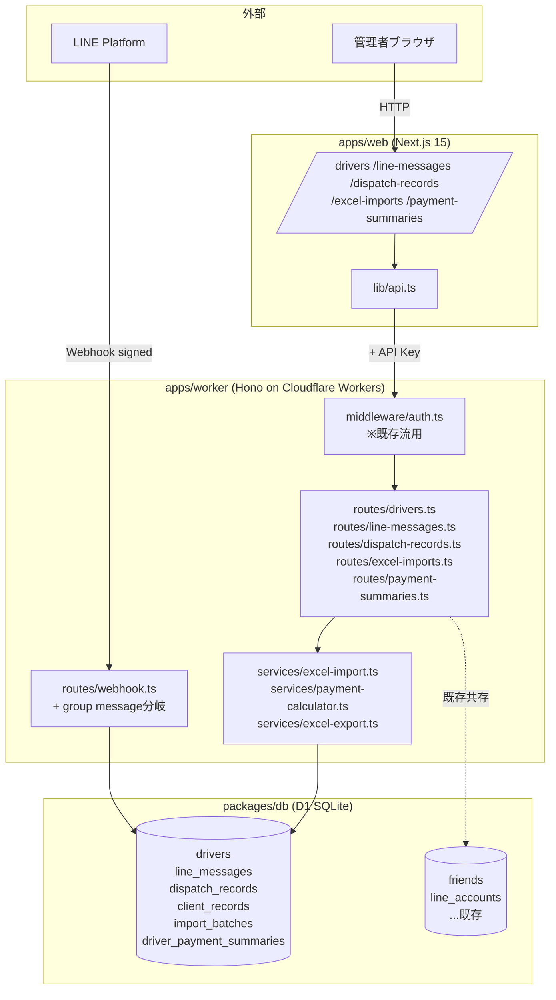
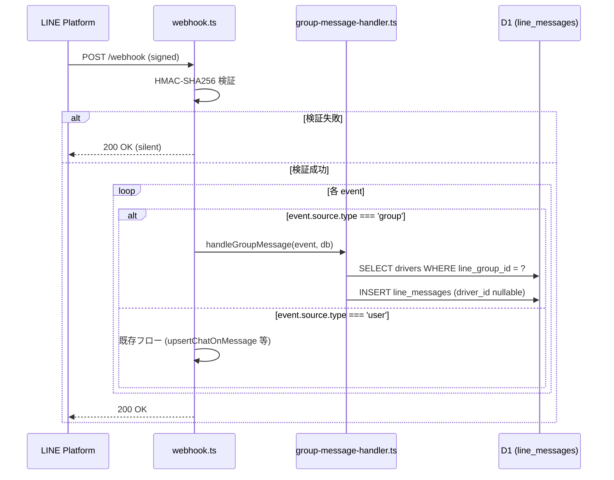
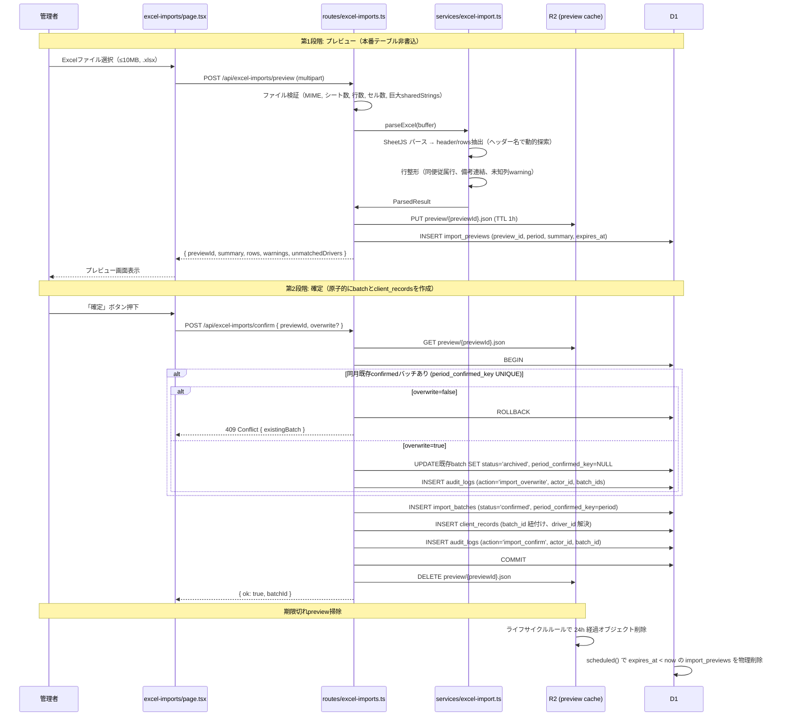
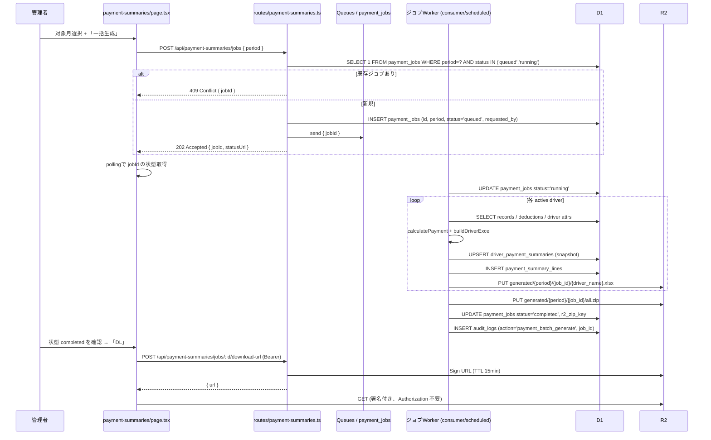
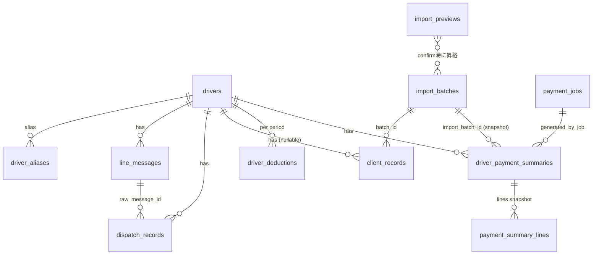

# Design Document — Phase 1 MVP

## Overview

**Purpose**: STEELO 稼働照合・ドライバー支払明細システムの Phase 1 MVP として、
LINE配車メッセージの自動蓄積（F1）、元請けBOND'sの支払明細Excelインポート（F3）、
管理画面の基本CRUD（F5）、ドライバー別支払明細Excelの自動生成（F6）を実現する。

**Users**: STEELO代表（管理者1名）が管理画面を介して照合準備データを整え、
月次の支払明細を生成する。ドライバー約20名は本システムを直接使わず、
従来通りLINEで配車を受信・完了報告する。

**Impact**: 既存LINE Harnessリポジトリに対し、運送業ドメインの新規テーブル
（`drivers`, `line_messages`, `dispatch_records`, `client_records`, `import_batches`,
`driver_payment_summaries`）と、それを操作する新規ルート/サービス/管理画面を**加算的に**
追加する。既存の友だち/シナリオ/broadcast機能は無変更で共存する。

### Goals

- LINEグループメッセージを欠落なく自動蓄積（Webhookは 200 を 3秒以内に返し、
  D1 書き込みは `executionCtx.waitUntil` で非同期に完了、`message_id` UNIQUE で
  再送冪等性を担保）
- BOND's Excel（ヘッダー+明細部）を2段階インポート（プレビュー→確定）で
  誤投入を防止。**プレビュー段階では本番テーブルに書き込まない**（メモリ返却 +
  preview セッションキャッシュ）
- ドライバー支払明細の計算ロジック（手数料控除 → インボイス分岐 → 四捨五入）を
  数式レベルで決定論的に実装し、生成時の手数料率・税率・インボイス有無を
  サマリーに**スナップショット保存**
- 個別ドライバーのExcel生成は同期APIで完結、月次一括ZIP生成は**非同期ジョブ**
  （R2 保存 + 生成済みファイルの再ダウンロード）に分離
- 既存LINE Harnessの設計パターン（routes/services/db分離、共有型、snake↔camel変換）に準拠

### Non-Goals

- Claude Haiku によるメッセージ自動解析（F2、Phase 2）
- 配車レコードと元請けレコードの自動マッチング（F4、Phase 2）
- 照合結果画面・差分レポート（Phase 2）
- 異常値検出・学習データ蓄積（Phase 3）
- 既存LINE Harnessの友だち/シナリオ/broadcast機能の変更

## Boundary Commitments

### This Spec Owns

- ドライバーマスタ（`drivers`, `driver_aliases`）の管理
- ドライバー月次控除マスタ（`driver_deductions`、車両代/電算処理費/前払金 per driver per period）
- LINEグループメッセージの受信・蓄積（`line_messages`、message_id UNIQUEで再送冪等）
- 配車レコードの手動CRUD（`dispatch_records`、Phase 1は手動入力）
- BOND's Excelインポートとパース処理（`import_batches`, `client_records`,
  `import_previews` + R2 preview cache）
- ドライバー支払明細の計算・Excel生成（`driver_payment_summaries`,
  `payment_summary_lines`, `payment_jobs` + R2 生成物保管）
- 監査ログ（`audit_logs`）
- 管理画面の新規ページ群とナビゲーション項目追加（Cloudflare Access 配下）

### Out of Boundary

- LINE個別チャット（ドライバー個人とのDM）は本Spec対象外（既存LINE Harnessの
  `chats`/`messages_log` がカバー）
- 配車メッセージの自動解析（Phase 2 で `services/dispatch-parser.ts` を追加予定）
- 自動照合エンジン（Phase 2 で `services/reconciliation.ts` を追加予定）
- 既存LINE Harnessのテーブル（`friends`, `scenarios`, `broadcasts` 等）の変更
- 認証機構自体（既存APIキー認証 + `auth-guard.tsx` を流用）

### Allowed Dependencies

- `@line-crm/line-sdk`: LINE Messaging API クライアント、Webhook 署名検証
- `@line-crm/db`: 既存D1ヘルパー（`getLineAccounts`, `jstNow` 等）+ 本Specで追加するクエリ関数群
- `@line-crm/shared`: 既存共有型（必要に応じ拡張）
- `xlsx` (SheetJS): Excel読み書き（Phase 1で新規導入）
- `jszip`: ZIP生成（Phase 1で新規導入）
- **Cloudflare R2**: preview JSON 短期キャッシュ、生成済み xlsx / ZIP の永続保管
- **Cloudflare Queues**（推奨）: 一括生成ジョブの非同期実行。導入できない場合は
  `payment_jobs` テーブル + Scheduled Worker で代替
- **Cloudflare Access**: 管理者人間認証（必須）

### Revalidation Triggers

以下が変わると Phase 2 の照合エンジン設計に影響するため再検証が必要:

- `dispatch_records` または `client_records` のスキーマ変更
- ドライバー紐付けキー（`drivers.line_group_id`, `drivers.name`）の変更
- 元請けExcelのレイアウト変更（BOND'sのフォーマット変更）
- 支払計算式の変更（手数料率、消費税率、インボイス分岐ロジック）

## Architecture

### Existing Architecture Analysis

LINE Harness の基本設計は以下:

- **`apps/worker/src/index.ts`**: 60+ ルートを `app.route('/api/...', xxx)` でマウントする
  集約ポイント。Cron トリガーも `scheduled()` ハンドラで定義
- **`apps/worker/src/routes/webhook.ts`**: LINE Webhook受信。`message` イベントは
  `upsertChatOnMessage()` で個別チャット保存、`friend_add` は `upsertFriend()` で友だち登録。
  グループメッセージは現状ハンドリングされていない（個別チャットのみ前提）
- **`apps/worker/src/middleware/auth.ts`**: APIキー認証（`/webhook`, `/auth/`, `/liff/` は除外）
- **`packages/db/src/*.ts`**: ドメイン別のクエリ関数群。`db: D1Database` を引数で受ける純粋関数
- **`apps/web/src/app/<feature>/page.tsx`**: Next.js 15 App Router の規約に従う。
  `components/app-shell.tsx` がナビゲーション。`lib/api.ts` がWorker API呼び出しwrapper

本Phaseはこのパターンを踏襲して **加算** する。

### Architecture Pattern & Boundary Map



**Architecture Integration**:
- 選択パターン: **既存モノレポの加算拡張**。LINE Harnessの「Hono routes → services →
  @line-crm/db クエリ関数 → D1」の層構造をそのまま使う
- ドメイン境界: 運送業向けの新ドメイン（`drivers`, `dispatch_records`, `client_records`,
  `import_batches`, `payment_summaries`）を1ファイル1ドメインで分離
- 既存パターン保持: API key認証、`@line-crm/shared` 型集約、JST timestamp、UUID PK
- 新規コンポーネントの根拠:
  - Excel処理は重い処理になりうるためサービス層に分離（routes は薄く保つ）
  - 計算ロジック（`payment-calculator.ts`）は純粋関数化してユニットテストしやすくする
- steering準拠: `structure.md` の「新しいドメインを追加する手順」をそのまま適用

### Technology Stack

| Layer | Choice / Version | Role in Feature | Notes |
|-------|------------------|-----------------|-------|
| Frontend | Next.js 15 (App Router) + React 19 | 管理画面の新規ページ群 | 既存 `app-shell` にメニュー追加 |
| API | Hono on Cloudflare Workers | 新規 5 ルートファイル | 既存`index.ts`にマウント |
| DB | Cloudflare D1 (SQLite) | 新規9テーブル | migration `046_steelo_phase1.sql` で追加 |
| Excel I/O | xlsx (SheetJS) ^0.20 | Excelパース・生成 | Workers ESM build を使用、上限値で DoS 緩和 |
| ZIP | jszip ^3.10 | 一括DL時のZIP圧縮 | 非同期ジョブ + R2 経由ストリーミング |
| LINE | @line-crm/line-sdk (内部) | Webhook受信・署名検証 | 既存ライブラリ流用、新規API不要 |
| Storage | **R2** + D1 | 生成済みExcel/ZIP本体、preview セッションキャッシュ | 個別 xlsx は同期返却、一括 ZIP は R2 保存 → 署名付きURLで再DL |
| Job | Cloudflare Queues (推奨) または Durable Object | 一括ZIP生成の非同期実行 | 同期Worker 30s 制限を超える処理を分離。Queues 未導入時は Scheduled + ジョブテーブル |
| Auth | **Cloudflare Access 必須** + 既存 middleware/auth.ts | 全新規ルート保護 | STEELO エンドポイントは Access 配下限定、Webhook は署名検証 |
| Audit | `audit_logs` テーブル | インポート確定・上書き・支払生成・マスタ変更を記録 | 誰がいつ何をしたかを追跡可能に |

**Workers制約への配慮**:
- 同期Worker: 個別 xlsx 生成（< 1秒目安）。CPU/メモリ上限はライブラリ実測ベンチを
  `services/excel-export.bench.ts` で計測し、ドライバー1名・1ヶ月分が 2秒以内・
  メモリ 16MB 以内に収まることを実装時にゲートする
- 非同期ジョブ: 一括ZIP生成は Queues 経由で別 isolate に投入し、生成済み ZIP は
  R2 に `{period}/{job_id}.zip` として保存。完了通知後、UI からは署名付きURL でDL
- フォールバック: Queues 未利用時は `payment_jobs` テーブルに pending を入れて
  Scheduled Worker（5分粒度）で逐次処理し、UI ポーリングで状態取得
- 同時 ZIP 生成上限: 1 期間につき1ジョブ（DB UNIQUE）

## File Structure Plan

### Directory Structure

```
apps/worker/src/
├── routes/
│   ├── webhook.ts                # ★既存。group message分岐を追加（拡張）
│   ├── drivers.ts                # ★新規。ドライバーマスタCRUD
│   ├── driver-aliases.ts         # ★新規。Excel DR名のゆれ吸収マスタCRUD
│   ├── driver-deductions.ts     # ★新規。月次per-driver控除CRUD
│   ├── line-messages.ts          # ★新規。LINEメッセージ閲覧API
│   ├── dispatch-records.ts       # ★新規。配車レコードCRUD
│   ├── excel-imports.ts          # ★新規。Excelアップロード・確定
│   ├── payment-summaries.ts      # ★新規。支払明細生成・個別DL
│   ├── payment-jobs.ts           # ★新規。非同期一括ジョブAPI
│   └── audit-logs.ts             # ★新規。監査ログ検索API
├── middleware/
│   └── steelo-cors.ts            # ★新規。STEELO API用の origin 限定CORS
├── services/
│   ├── group-message-handler.ts  # ★新規。group message受信処理
│   ├── excel-import.ts           # ★新規。SheetJSパース・行解析・validateXlsx
│   ├── payment-calculator.ts     # ★新規。純粋関数の支払計算
│   ├── payment-batch-job.ts      # ★新規。Queues consumer / Scheduled で一括生成
│   ├── excel-export.ts           # ★新規。明細Excel生成
│   └── audit.ts                  # ★新規。audit_logs 書き込みヘルパ
└── index.ts                      # ★既存。新規ルート群をマウント、Queues consumer登録

packages/db/
├── migrations/
│   └── 046_steelo_phase1.sql     # ★新規。STEELO 関連テーブル全体を追加
├── schema.sql                    # ★既存。046の内容を反映
└── src/
    ├── drivers.ts                # ★新規。ドライバークエリ
    ├── driver-aliases.ts         # ★新規。エイリアスクエリ
    ├── driver-deductions.ts      # ★新規。月次控除クエリ
    ├── line-messages.ts          # ★新規。LINEメッセージクエリ
    ├── dispatch-records.ts       # ★新規。配車レコードクエリ
    ├── client-records.ts         # ★新規。元請けレコードクエリ
    ├── import-batches.ts         # ★新規。インポート履歴クエリ
    ├── import-previews.ts        # ★新規。preview セッションクエリ
    ├── payment-summaries.ts      # ★新規。支払サマリークエリ
    ├── payment-summary-lines.ts  # ★新規。明細スナップショットクエリ
    ├── payment-jobs.ts           # ★新規。非同期ジョブクエリ
    └── audit-logs.ts             # ★新規。監査ログクエリ

packages/shared/src/
└── types.ts                      # ★既存。STEELO関連型を追記

apps/web/src/
├── app/
│   ├── drivers/page.tsx          # ★新規。ドライバーマスタ一覧・編集
│   ├── line-messages/page.tsx    # ★新規。LINEメッセージ閲覧
│   ├── dispatch-records/page.tsx # ★新規。配車レコード一覧・編集
│   ├── excel-imports/page.tsx    # ★新規。Excelアップロード・確定
│   └── payment-summaries/page.tsx # ★新規。支払明細生成・DL
├── components/
│   ├── app-shell.tsx             # ★既存。メニュー項目追加
│   ├── drivers/driver-form.tsx   # ★新規
│   ├── excel-imports/import-preview.tsx # ★新規
│   └── payment-summaries/generate-form.tsx # ★新規
└── lib/
    └── api.ts                    # ★既存。新規エンドポイント関数追記
```

### Modified Files

- `apps/worker/src/routes/webhook.ts`: group メッセージ判定の分岐を追加。
  個別チャットフロー（`upsertChatOnMessage`）の手前で `source.type === 'group'`
  なら `handleGroupMessage()` を呼ぶ
- `apps/worker/src/index.ts`: 新規5ルートを `app.route('/api/...', xxx)` でマウント
- `apps/web/src/components/app-shell.tsx`: ナビゲーションに5項目追加
- `apps/web/src/lib/api.ts`: 新規エンドポイントの呼び出し関数追記
- `packages/shared/src/types.ts`: `Driver`, `LineMessage`, `DispatchRecord`,
  `ClientRecord`, `ImportBatch`, `DriverPaymentSummary` 型を追加
- `packages/db/schema.sql`: migration 046 の内容を反映（fresh deploy用）

## System Flows

### F1 グループメッセージ受信フロー



**ポイント**: 既存の friend/scenario 関連処理は group 経由では呼ばない。
LINEのWebhook 1分タイムアウト制約があるが、`line_messages` への単純INSERTのみで
3秒以内応答可能。

### F3 Excelインポートフロー（2段階・プレビュー非永続化）



**ポイント**:
- **プレビュー段階で `client_records` を一切INSERT しない** — 誤投入リスクの根を断つ
- preview body は R2 に JSON で短期キャッシュし、`import_previews` は索引・期限管理のみ
- 確定処理は `BEGIN` / `COMMIT` で一括し、`period_confirmed_key` UNIQUE 制約で
  二重 confirmed をDB側でも排除（後述 schema 参照）

### F6-a 支払明細 個別生成フロー（同期）

```mermaid
sequenceDiagram
    participant U as 管理者
    participant Web as payment-summaries/page.tsx
    participant API as routes/payment-summaries.ts
    participant Calc as payment-calculator.ts
    participant Excel as excel-export.ts
    participant DB as D1

    U->>Web: 対象月＋ドライバー選択 + 「個別DL」
    Web->>API: fetch POST /api/payment-summaries/generate (Bearer)
    API->>DB: SELECT confirmed batch WHERE period=?
    API->>DB: SELECT driver, SELECT driver_deductions WHERE driver_id, period
    API->>DB: SELECT client_records WHERE driver_id=? AND period=?
    API->>Calc: calculatePayment(records, batch, driver, deductions, taxRate, commissionRate)
    Calc-->>API: PaymentResult
    API->>DB: BEGIN; UPSERT driver_payment_summaries (snapshot all rates + batch_id);
    API->>DB: INSERT payment_summary_lines (生成時の明細スナップショット)
    API->>DB: INSERT audit_logs (action='payment_generate', driver_id, period)
    API->>DB: COMMIT
    API->>Excel: buildDriverExcel(driver, records, result)
    Excel-->>API: Uint8Array (.xlsx)
    API-->>Web: 200 (application/octet-stream + Content-Disposition)
    Web->>Web: fetch().blob() → createObjectURL → 一時 <a download> でDL
```

### F6-b 支払明細 月次一括生成フロー（非同期）



**ポイント**:
- 計算は純粋関数 `calculatePayment` に集約しユニットテスト可能にする
- 一括処理は別 isolate（Queues consumer か Scheduled Worker）に逃がし、
  同期 Worker の CPU/wall-clock 制約に縛られない
- 生成済み Excel/ZIP は R2 に保存 → サマリーは `import_batch_id` 紐付けで
  再ダウンロード可能（マスタ変更や Excel 上書き後も当時の明細を再現できる）
- DL は **fetch + Blob** 方式または **短命署名付き URL** のみ。
  `<a href download>` で API にアクセスしない（Authorization ヘッダ送信不可のため）

## Requirements Traceability

| Requirement | Summary | Components | Interfaces | Flows |
|-------------|---------|------------|------------|-------|
| 1.1〜1.8 | LINE グループメッセージ受信・蓄積（冪等性・非同期保存） | webhook.ts (拡張), group-message-handler.ts, line-messages.ts (query), audit.ts | POST /webhook | F1 受信フロー |
| 2.1〜2.5 | ドライバーマスタCRUD | routes/drivers.ts, packages/db/src/drivers.ts, drivers/page.tsx, drivers/driver-form.tsx | GET/POST/PATCH/DELETE /api/drivers | — |
| 3.1〜3.10 | 元請けExcelインポート（上限検証・列名探索・preview非永続化・原子確定・別名解決） | excel-imports.ts, excel-import.ts (service + validateXlsx), import-previews.ts, import-batches.ts, client-records.ts, R2, audit.ts | POST /api/excel-imports/preview, POST /api/excel-imports/confirm | F3 インポートフロー |
| 4.1〜4.6 | LINEメッセージ・配車レコード閲覧 | line-messages.ts (route), dispatch-records.ts (route), line-messages/page.tsx, dispatch-records/page.tsx | GET /api/line-messages, GET/POST/PATCH /api/dispatch-records | — |
| 5.1〜5.13 | 支払明細Excel生成（個別=同期API、一括=非同期ジョブ、スナップショット、R2再DL） | payment-summaries.ts, payment-jobs.ts, payment-calculator.ts, excel-export.ts, payment-batch-job.ts, R2, audit.ts | POST /api/payment-summaries/generate, POST /api/payment-summaries/jobs, GET /api/payment-summaries/jobs/:id, POST /api/payment-summaries/jobs/:id/download-url, POST /api/payment-summaries/:id/download-url | F6-a / F6-b フロー |
| 6.1〜6.8 | 認証・基本UI（Cloudflare Access必須、CORS限定、fetch+Blob DL、audit_logs） | Cloudflare Access (運用), middleware/auth.ts (流用), steelo-cors.ts, app-shell.tsx, 各 page.tsx, audit-logs.ts | GET /api/audit-logs | — |
| 7.1〜7.7 | データ整合性・非機能（行単位丸め、性能、スナップショット） | DB schema, payment-calculator.ts (Math.round), 全ルート | — | — |
| 8.1〜8.4 | ドライバー別名マスタ | driver-aliases.ts (route+query), excel-import.ts (resolver), driver-aliases/page.tsx | GET/POST/DELETE /api/driver-aliases | F3 内 alias 解決 |
| 9.1〜9.5 | 月次控除マスタ | driver-deductions.ts (route+query), driver-deductions/page.tsx, payment-calculator.ts | GET/PUT /api/driver-deductions | F6 内 deductions 読込 |
| 10.1〜10.4 | 監査ログ | audit.ts, audit-logs.ts, audit-logs/page.tsx | GET /api/audit-logs | 各操作からの書き込み |

## Components and Interfaces

| Component | Domain/Layer | Intent | Req Coverage | Key Dependencies | Contracts |
|-----------|--------------|--------|--------------|------------------|-----------|
| webhook.ts (拡張) | Worker / Routes | グループメッセージ分岐 | 1.1〜1.6 | group-message-handler, line-sdk (P0) | API |
| group-message-handler.ts | Worker / Services | グループ受信処理（冪等・waitUntil） | 1.1〜1.6 | drivers query, line-messages query, audit (P0) | Service |
| drivers.ts (route+query) | Worker / Routes+DB | ドライバーマスタCRUD | 2.1〜2.5 | D1, audit (P0) | API, Service |
| driver-aliases.ts | Worker / Routes+DB | Excel DR 名ゆれ吸収マスタ | 3.7, 7.x | D1, audit (P0) | API, Service |
| driver-deductions.ts | Worker / Routes+DB | per-driver per-period 控除マスタ | 5.x, 7.x | D1, audit (P0) | API, Service |
| excel-imports.ts | Worker / Routes | Excelアップロード・確定API | 3.1〜3.7 | excel-import service, R2, audit (P0) | API |
| excel-import.ts | Worker / Services | SheetJSパース・上限検証・列名探索 | 3.1〜3.7 | xlsx (P0) | Service |
| payment-calculator.ts | Worker / Services | 支払計算（純粋関数、スナップショット入力） | 5.1〜5.9, 7.1 | — | Service |
| excel-export.ts | Worker / Services | 明細Excel生成 | 5.1〜5.9 | xlsx (P0) | Service |
| payment-batch-job.ts | Worker / Services | 一括ZIP非同期生成（Queues/Scheduled consumer） | 5.7, 7.x | calculator, exporter, R2, jszip, audit (P0) | Service |
| payment-summaries.ts | Worker / Routes+DB | 個別生成API + 既存サマリー検索 | 5.1〜5.6, 5.8, 5.9 | calculator, exporter, R2 sign (P0) | API |
| payment-jobs.ts | Worker / Routes+DB | 非同期一括ジョブAPI | 5.7 | payment-batch-job, R2 sign (P0) | API |
| audit-logs.ts | Worker / Routes+DB | 監査ログ検索API | 6.x, 7.x | D1 (P0) | API |
| steelo-cors.ts | Worker / Middleware | STEELO API用 origin限定CORS | Security | env STEELO_WEB_ORIGINS (P0) | Middleware |
| audit.ts | Worker / Services | audit_logs 書き込みヘルパ | 6.x, 7.x | D1 (P0) | Service |
| drivers/page.tsx | Web / UI | ドライバーマスタ画面 | 2.1〜2.5 | api.ts (P0) | UI |
| driver-aliases/page.tsx | Web / UI | エイリアスマスタ画面 | 3.7 | api.ts (P0) | UI |
| driver-deductions/page.tsx | Web / UI | 月次控除入力画面 | 5.x | api.ts (P0) | UI |
| excel-imports/page.tsx | Web / UI | アップロード・プレビュー画面 | 3.1〜3.7 | api.ts (P0) | UI |
| payment-summaries/page.tsx | Web / UI | 支払明細生成画面（個別＋ジョブ） | 5.1〜5.9 | api.ts (P0) | UI |
| audit-logs/page.tsx | Web / UI | 監査ログ閲覧 | 6.x, 7.x | api.ts (P0) | UI |

### Worker / Services

#### group-message-handler.ts

| Field | Detail |
|-------|--------|
| Intent | LINEグループ送信メッセージを受け取り `line_messages` に蓄積する |
| Requirements | 1.1, 1.2, 1.3, 1.5 |

**Responsibilities & Constraints**
- 受信eventごとに driver 紐付けを試行（`drivers.line_group_id` 一致で `driver_id` 確定）
- バイナリ系（image/file/video/audio）はメタデータのみ保存
- 既存の友だち/シナリオ処理は呼ばない

**Dependencies**
- Inbound: webhook.ts (P0)
- Outbound: `@line-crm/db` の `getDriverByLineGroupId`, `insertLineMessage` (P0)

**Contracts**: Service [x]

```typescript
interface GroupMessageHandler {
  handleGroupMessage(
    event: WebhookEvent & { source: { type: 'group'; groupId: string } },
    db: D1Database
  ): Promise<void>
}
```

- Preconditions: event は LINE 署名検証済み、source.type === 'group'
- Postconditions: `line_messages` に 1 行 INSERT、driver_id は一致あれば設定、なければ NULL
- Invariants: 既存 friends/chats テーブルには書き込まない

#### excel-import.ts

| Field | Detail |
|-------|--------|
| Intent | アップロードされたBOND's Excelをパースし、ヘッダーと明細行を構造化データに変換 |
| Requirements | 3.1, 3.2, 3.3, 3.4 |

**Responsibilities & Constraints**
- ヘッダー部から運賃合計/立替/控除項目/対象月を抽出
- 明細部の同便従属行（運賃が `-`）は `fare = NULL` でスルー
- 連続する空メイン行の備考は直前行に連結

**Dependencies**
- Outbound: `xlsx` パッケージ (P0)

**Contracts**: Service [x]

```typescript
type ParsedExcel = {
  header: {
    period: string              // "2026-05"
    totalFare: number           // 税抜
    totalAdvance: number
    vehicleCost: number
    processingFee: number
    prepayment: number
    commissionRate: number      // 0.075 既定
  }
  rows: ParsedRow[]
  warnings: string[]
}

type ParsedRow = {
  workDay: number               // 1-31
  dayOfWeek: string
  taskName: string | null
  pickupLocation: string | null
  deliveryLocation: string | null
  startTime: string | null
  endTime: string | null
  distanceKm: number | null
  advancePayment: number        // 円
  fare: number | null           // 円、null=同便従属行
  driverName: string | null
  notes: string | null
}

interface ExcelImporter {
  parseExcel(buffer: ArrayBuffer): ParsedExcel
}
```

#### payment-calculator.ts

| Field | Detail |
|-------|--------|
| Intent | 単一ドライバーの月次支払額を確定論的に計算する純粋関数群 |
| Requirements | 5.1〜5.9, 7.1 |

**Responsibilities & Constraints**
- `fare = NULL` の行は計算から除外（明細掲載はする、計算からは除外）
- 各行単位で 「手数料控除 → 消費税適用 → `Math.round()`」 を行い、行ごとの税込値を合算
  （合算後四捨五入だと累積誤差が出るため）
- 控除（車両代/電算処理費/前払金）は **batch ヘッダーではなく driver_deductions の値**を渡す
- `commissionRate` `taxRate` も呼び出し側でスナップショット値を渡す（純粋関数化）
- 計算結果がマイナスでもそのまま返す（赤字表示は出力側責務）

**Dependencies**: なし（純粋関数）

**Contracts**: Service [x]

```typescript
type PaymentInput = {
  driver: { hasInvoice: boolean }
  rates: {
    commissionRate: number     // 0.075（生成時スナップショット）
    taxRate: number            // 0.10（生成時スナップショット）
  }
  deductions: {                // per-driver, per-period（driver_deductions 由来）
    vehicleCost: number
    processingFee: number
    prepayment: number
  }
  records: { fare: number | null; advancePayment: number }[]
}

type PaymentResult = {
  fareLines: {
    fareAfterCommission: number | null   // fare=NULL なら null
    fareWithTax: number | null
    advance: number
    excludedFromCalc: boolean
  }[]
  totalFareBeforeTax: number             // 行単位四捨五入後の手数料控除後合計
  totalFareWithTax: number               // 行単位四捨五入後の税込合計
  totalAdvance: number
  vehicleCost: number
  processingFee: number
  prepayment: number
  finalAmount: number                    // = totalFareWithTax + totalAdvance - 各控除
}

function calculatePayment(input: PaymentInput): PaymentResult
```

- Preconditions: `commissionRate`, `taxRate` は 0〜1、`hasInvoice` は boolean、
  控除は非負整数
- Postconditions: 全ての金額は整数。`hasInvoice=false` のときは `fareWithTax === fareAfterCommission`
- Invariants: `fare = null` の行は `excludedFromCalc=true` で `fareLines` に残し、
  totals には含めない。控除は **batch ヘッダーから一切引かない**（呼び出し側が
  driver_deductions を渡す責務）

#### excel-export.ts

| Field | Detail |
|-------|--------|
| Intent | 計算結果をBOND'sフォーマットベースのドライバー宛Excelに整形・ZIP化 |
| Requirements | 5.4〜5.7 |

**Contracts**: Service [x]

```typescript
interface ExcelExporter {
  buildDriverExcel(args: {
    driver: Driver
    period: string
    records: ClientRecord[]
    result: PaymentResult
  }): Uint8Array  // .xlsx buffer

  zipAll(files: { name: string; buffer: Uint8Array }[]): Promise<Uint8Array>
}
```

### Worker / Routes

#### API Contract

| Method | Endpoint | Request | Response | Errors |
|--------|----------|---------|----------|--------|
| GET | /api/drivers | — | `Driver[]` | 401 |
| POST | /api/drivers | `DriverCreate` | `Driver` | 400, 401, 409 (duplicate group_id) |
| PATCH | /api/drivers/:id | `DriverUpdate` | `Driver` | 400, 401, 404 |
| DELETE | /api/drivers/:id | — | `{ ok: true }` (論理削除) | 401, 404 |
| GET | /api/driver-aliases | query: `driver_id?` | `DriverAlias[]` | 401 |
| POST | /api/driver-aliases | `{ driver_id, alias_name }` | `DriverAlias` | 400, 401, 409 |
| DELETE | /api/driver-aliases/:id | — | `{ ok: true }` | 401, 404 |
| GET | /api/driver-deductions | query: `period?, driver_id?` | `DriverDeduction[]` | 401 |
| PUT | /api/driver-deductions | `{ driver_id, period, vehicle_cost, processing_fee, prepayment, notes? }` | `DriverDeduction` | 400, 401 |
| GET | /api/line-messages | query: `driver_id?, from?, to?, type?, limit?, offset?` | `{ items: LineMessage[]; total }` | 401 |
| GET | /api/line-messages/:id | — | `LineMessage` | 401, 404 |
| GET | /api/dispatch-records | query: `driver_id?, from?, to?` | `{ items: DispatchRecord[]; total }` | 401 |
| POST | /api/dispatch-records | `DispatchCreate` | `DispatchRecord` | 400, 401 |
| PATCH | /api/dispatch-records/:id | `DispatchUpdate` | `DispatchRecord` | 400, 401, 404 |
| POST | /api/excel-imports/preview | multipart `file` | `{ previewId, summary, rows, warnings, unmatchedDrivers, expiresAt }` | 400 (parse/validation error), 401, 413 (>10MB), 422 (limits exceeded) |
| POST | /api/excel-imports/confirm | `{ previewId, overwrite? }` | `{ ok: true, batchId }` | 401, 404 (preview expired), 409 (duplicate period without overwrite) |
| GET | /api/excel-imports | query: `period?, status?` | `ImportBatch[]` | 401 |
| GET | /api/payment-summaries | query: `period` | `DriverPaymentSummary[]` | 401, 404 |
| **POST** | **/api/payment-summaries/generate** | `{ driver_id, period }` (個別・同期) | `application/vnd.openxmlformats-officedocument.spreadsheetml.sheet` body | 400, 401, 404 |
| **POST** | **/api/payment-summaries/jobs** | `{ period }` (一括・非同期キューイング) | `202 { jobId, statusUrl }` | 401, 404 (no confirmed batch), 409 (duplicate job for period) |
| GET | /api/payment-summaries/jobs/:id | — | `{ id, status, progress, r2Key?, error? }` | 401, 404 |
| POST | /api/payment-summaries/jobs/:id/download-url | — | `{ url, expiresAt }` (R2 signed URL, TTL 15min) | 401, 404, 410 (R2オブジェクト消失) |
| GET | /api/payment-summaries/:summaryId/download-url | — | `{ url, expiresAt }` (個別Excel再DL) | 401, 404, 410 |
| GET | /api/audit-logs | query: `actor?, action?, from?, to?, limit?, offset?` | `{ items: AuditLog[]; total }` | 401, 403 (admin only) |

全ルートは既存 `middleware/auth.ts` のAPIキー認証下にマウントし、**さらに
Cloudflare Access による前段認証下**に置く（後述 Security 参照）。
入力検証は各routeで Zod 風の手動チェック（既存LINE Harnessに準拠）。
**全ての DL は Bearer トークン付き fetch + Blob か署名付き URL で行い、
`<a href="/api/..." download>` で API を直接叩かない**。

### Web / UI

各 `page.tsx` は server component を基本とし、フォーム部分のみ `'use client'`
コンポーネントを切り出す。`lib/api.ts` は Cookie/localStorage の API key を
付与して fetch する既存wrapper を流用。

**実装ノート**:
- Excelファイルアップロードは `<input type="file" accept=".xlsx">` + `FormData` で送信。
  クライアント側でも MIME / 拡張子 / サイズを事前チェック
- **ダウンロードは fetch + Blob 方式**で行い、Authorization ヘッダを必ず送る。
  `<a href="/api/..." download>` で API を直接呼ばない（Bearer 送信不可・認証バイパスの温床になるため）。
  例: `const res = await api.get(...); const blob = await res.blob(); const url = URL.createObjectURL(blob); ...`
- 一括ZIP の DL は「ジョブ完了 → 署名付き URL を取得 → R2 に直接 GET（短命15分）」の3段
- 大きなリストは仮想スクロール不要（月1,000件規模なら通常テーブルで十分）
- preview 画面の TTL（1h）を画面側に明示し、期限切れ時は `previewId` を破棄して再アップロードを促す

## Data Models

### Logical Data Model



**Key relationships**:
- `drivers.id` は他テーブルへFK。`line_group_id` も UNIQUE で実質的な代替キー
- `driver_aliases.alias_name` は Excel DR 名のゆれ（旧姓・空白・カナ等）を吸収するための
  別名マスタ。Excel取込時はまず `drivers.name` 完全一致を試み、失敗時に
  `driver_aliases.alias_name` を引く
- `client_records.driver_id` は NULL 許容（一致なしの場合）
- `driver_deductions` は driver × period の per-driver 控除（車両代/電算処理費/前払金）。
  支払計算ではこちらの値を使い、`import_batches` 側の控除カラムは BOND's Excel
  ヘッダーの会社合計値として参照のみ（突き合わせで差分検出に使う）
- `driver_payment_summaries` は生成時の `import_batch_id`、`commission_rate`、
  `tax_rate`、`has_invoice`、`driver_name_snapshot` を**スナップショット保存**して
  マスタ変更後も当時の明細を再現可能にする
- `payment_summary_lines` は明細行単位のスナップショット（fare, fareAfterCommission,
  fareWithTax）。R2 上の Excel 再生成が必要なときも DB だけで再構築できる
- `import_previews` は preview セッションの索引と期限管理。本体ペイロードは R2

### Physical Data Model

migration `046_steelo_phase1.sql` で以下を作成。全 PK は TEXT (UUID)、JST timestamp を
既存LINE Harnessの慣例（`strftime('%Y-%m-%dT%H:%M:%f', 'now', '+9 hours')`）で生成。

```sql
-- drivers
CREATE TABLE IF NOT EXISTS drivers (
  id               TEXT PRIMARY KEY,
  name             TEXT NOT NULL,
  name_kana        TEXT,
  line_group_id    TEXT UNIQUE,
  line_group_name  TEXT,
  has_invoice      INTEGER NOT NULL DEFAULT 0,
  is_active        INTEGER NOT NULL DEFAULT 1,
  notes            TEXT,
  created_at       TEXT NOT NULL DEFAULT (strftime('%Y-%m-%dT%H:%M:%f', 'now', '+9 hours')),
  updated_at       TEXT NOT NULL DEFAULT (strftime('%Y-%m-%dT%H:%M:%f', 'now', '+9 hours'))
);
CREATE INDEX IF NOT EXISTS idx_drivers_line_group_id ON drivers (line_group_id);
CREATE INDEX IF NOT EXISTS idx_drivers_is_active ON drivers (is_active);

-- driver_aliases  (Excel DR名のゆれ吸収用)
CREATE TABLE IF NOT EXISTS driver_aliases (
  id          TEXT PRIMARY KEY,
  driver_id   TEXT NOT NULL REFERENCES drivers (id) ON DELETE CASCADE,
  alias_name  TEXT NOT NULL,
  created_at  TEXT NOT NULL DEFAULT (strftime('%Y-%m-%dT%H:%M:%f', 'now', '+9 hours')),
  UNIQUE (alias_name)
);
CREATE INDEX IF NOT EXISTS idx_driver_aliases_driver ON driver_aliases (driver_id);

-- line_messages
CREATE TABLE IF NOT EXISTS line_messages (
  id              TEXT PRIMARY KEY,
  group_id        TEXT NOT NULL,
  driver_id       TEXT REFERENCES drivers (id) ON DELETE SET NULL,
  sender_user_id  TEXT,
  sender_name     TEXT,
  message_id      TEXT NOT NULL,       -- LINE側のメッセージID（再送冪等性のためNOT NULL）
  message_type    TEXT NOT NULL,       -- text/image/file/video/audio/sticker
  message_text    TEXT,                -- text以外はNULL可
  is_dispatch     INTEGER NOT NULL DEFAULT 0,
  is_parsed       INTEGER NOT NULL DEFAULT 0,
  received_at     TEXT NOT NULL,
  created_at      TEXT NOT NULL DEFAULT (strftime('%Y-%m-%dT%H:%M:%f', 'now', '+9 hours')),
  UNIQUE (message_id)                  -- LINE Webhook 再送時の重複保存を防ぐ
);
CREATE INDEX IF NOT EXISTS idx_line_messages_driver_received ON line_messages (driver_id, received_at DESC);
CREATE INDEX IF NOT EXISTS idx_line_messages_group_received ON line_messages (group_id, received_at DESC);

-- dispatch_records
CREATE TABLE IF NOT EXISTS dispatch_records (
  id                  TEXT PRIMARY KEY,
  driver_id           TEXT NOT NULL REFERENCES drivers (id) ON DELETE CASCADE,
  work_date           TEXT NOT NULL,
  task_number         INTEGER,
  task_name           TEXT,
  pickup_location     TEXT,
  delivery_location   TEXT,
  start_time          TEXT,
  end_time            TEXT,
  management_number   TEXT,
  raw_message_id      TEXT REFERENCES line_messages (id) ON DELETE SET NULL,
  confidence          TEXT NOT NULL DEFAULT 'high',
  status              TEXT NOT NULL DEFAULT 'confirmed',  -- Phase1は手動入力 → 'confirmed'
  created_at          TEXT NOT NULL DEFAULT (strftime('%Y-%m-%dT%H:%M:%f', 'now', '+9 hours')),
  updated_at          TEXT NOT NULL DEFAULT (strftime('%Y-%m-%dT%H:%M:%f', 'now', '+9 hours'))
);
CREATE INDEX IF NOT EXISTS idx_dispatch_driver_date ON dispatch_records (driver_id, work_date);

-- import_previews  (preview セッション索引、本体は R2)
CREATE TABLE IF NOT EXISTS import_previews (
  preview_id   TEXT PRIMARY KEY,
  period       TEXT NOT NULL,
  file_name    TEXT,
  row_count    INTEGER NOT NULL,
  summary_json TEXT NOT NULL,           -- warningsやsummaryのスナップショット
  r2_key       TEXT NOT NULL,           -- R2 上の preview JSON への参照
  created_by   TEXT NOT NULL,           -- actor id
  created_at   TEXT NOT NULL DEFAULT (strftime('%Y-%m-%dT%H:%M:%f', 'now', '+9 hours')),
  expires_at   TEXT NOT NULL            -- TTL 1h を想定
);
CREATE INDEX IF NOT EXISTS idx_import_previews_expires ON import_previews (expires_at);

-- import_batches
-- 注: vehicle_cost/processing_fee/prepayment は BOND's Excel ヘッダーの
-- 「会社合計」値。各ドライバーへの控除適用は別途 driver_deductions を見る
-- （以前は全ドライバーに同じ控除を加算するバグ構造だった）。
CREATE TABLE IF NOT EXISTS import_batches (
  id                     TEXT PRIMARY KEY,
  period                 TEXT NOT NULL,        -- "2026-05"
  file_name              TEXT,
  total_records          INTEGER NOT NULL DEFAULT 0,
  total_fare             INTEGER NOT NULL DEFAULT 0,
  total_advance          INTEGER NOT NULL DEFAULT 0,
  header_vehicle_cost    INTEGER NOT NULL DEFAULT 0,  -- 会社合計（参照のみ）
  header_processing_fee  INTEGER NOT NULL DEFAULT 0,  -- 会社合計（参照のみ）
  header_prepayment      INTEGER NOT NULL DEFAULT 0,  -- 会社合計（参照のみ）
  commission_rate        REAL NOT NULL DEFAULT 0.075,
  tax_rate               REAL NOT NULL DEFAULT 0.10,  -- 生成時の消費税率スナップショット
  template_version       TEXT,                  -- BOND'sテンプレ識別子
  status                 TEXT NOT NULL DEFAULT 'pending',   -- pending/confirmed/archived
  -- DB側でも同一periodのconfirmed重複を防ぐ。NULLは許可するためarchived/pendingは複数可
  period_confirmed_key   TEXT GENERATED ALWAYS AS (CASE WHEN status='confirmed' THEN period END) VIRTUAL,
  imported_at            TEXT NOT NULL DEFAULT (strftime('%Y-%m-%dT%H:%M:%f', 'now', '+9 hours')),
  confirmed_at           TEXT,
  confirmed_by           TEXT,
  UNIQUE (period_confirmed_key)
);
CREATE INDEX IF NOT EXISTS idx_import_batches_period_status ON import_batches (period, status);

-- client_records
CREATE TABLE IF NOT EXISTS client_records (
  id                TEXT PRIMARY KEY,
  import_batch_id   TEXT NOT NULL REFERENCES import_batches (id) ON DELETE CASCADE,
  driver_id         TEXT REFERENCES drivers (id) ON DELETE SET NULL,
  period            TEXT NOT NULL,
  work_day          INTEGER NOT NULL,
  day_of_week       TEXT,
  task_name         TEXT,
  pickup_location   TEXT,
  delivery_location TEXT,
  start_time        TEXT,
  end_time          TEXT,
  distance_km       REAL,
  advance_payment   INTEGER NOT NULL DEFAULT 0,
  fare              INTEGER,             -- NULL = 同便従属行
  driver_name       TEXT,                -- ExcelのDR名（生値、紐付け不可時の参照用）
  notes             TEXT,
  created_at        TEXT NOT NULL DEFAULT (strftime('%Y-%m-%dT%H:%M:%f', 'now', '+9 hours'))
);
CREATE INDEX IF NOT EXISTS idx_client_records_batch ON client_records (import_batch_id);
CREATE INDEX IF NOT EXISTS idx_client_records_driver_period ON client_records (driver_id, period);

-- driver_deductions  (per-driver, per-period 控除マスタ)
-- 管理画面 F5 で月次に入力。支払計算は必ずこのテーブルを参照する。
CREATE TABLE IF NOT EXISTS driver_deductions (
  id              TEXT PRIMARY KEY,
  driver_id       TEXT NOT NULL REFERENCES drivers (id) ON DELETE CASCADE,
  period          TEXT NOT NULL,
  vehicle_cost    INTEGER NOT NULL DEFAULT 0,
  processing_fee  INTEGER NOT NULL DEFAULT 0,
  prepayment      INTEGER NOT NULL DEFAULT 0,
  notes           TEXT,
  created_at      TEXT NOT NULL DEFAULT (strftime('%Y-%m-%dT%H:%M:%f', 'now', '+9 hours')),
  updated_at      TEXT NOT NULL DEFAULT (strftime('%Y-%m-%dT%H:%M:%f', 'now', '+9 hours')),
  updated_by      TEXT,
  UNIQUE (driver_id, period)
);
CREATE INDEX IF NOT EXISTS idx_driver_deductions_period ON driver_deductions (period);

-- driver_payment_summaries  (生成時スナップショット)
CREATE TABLE IF NOT EXISTS driver_payment_summaries (
  id                      TEXT PRIMARY KEY,
  driver_id               TEXT NOT NULL REFERENCES drivers (id) ON DELETE CASCADE,
  period                  TEXT NOT NULL,
  import_batch_id         TEXT NOT NULL REFERENCES import_batches (id),   -- どのバッチ由来か
  payment_job_id          TEXT REFERENCES payment_jobs (id) ON DELETE SET NULL,
  driver_name_snapshot    TEXT NOT NULL,         -- 生成時の氏名（マスタ変更後の証跡）
  has_invoice_snapshot    INTEGER NOT NULL,
  commission_rate_snapshot REAL NOT NULL,         -- 例: 0.075
  tax_rate_snapshot       REAL NOT NULL,          -- 例: 0.10
  rounding_rule           TEXT NOT NULL DEFAULT 'per_line_round',  -- 行単位四捨五入を明示
  total_fare_before_tax   INTEGER NOT NULL,       -- 手数料控除後・税抜
  total_fare_with_tax     INTEGER NOT NULL,       -- 税込
  total_advance           INTEGER NOT NULL,
  vehicle_cost            INTEGER NOT NULL DEFAULT 0,  -- driver_deductions のスナップショット
  processing_fee          INTEGER NOT NULL DEFAULT 0,  -- 同上
  prepayment              INTEGER NOT NULL DEFAULT 0,  -- 同上
  final_amount            INTEGER NOT NULL,
  r2_xlsx_key             TEXT,                  -- 生成済み xlsx (R2)
  generated_at            TEXT NOT NULL DEFAULT (strftime('%Y-%m-%dT%H:%M:%f', 'now', '+9 hours')),
  UNIQUE (driver_id, period)
);
CREATE INDEX IF NOT EXISTS idx_payment_summaries_period ON driver_payment_summaries (period);
CREATE INDEX IF NOT EXISTS idx_payment_summaries_batch ON driver_payment_summaries (import_batch_id);

-- payment_summary_lines  (明細行スナップショット)
CREATE TABLE IF NOT EXISTS payment_summary_lines (
  id                      TEXT PRIMARY KEY,
  summary_id              TEXT NOT NULL REFERENCES driver_payment_summaries (id) ON DELETE CASCADE,
  client_record_id        TEXT REFERENCES client_records (id) ON DELETE SET NULL,
  work_day                INTEGER NOT NULL,
  task_name               TEXT,
  fare                    INTEGER,               -- 元運賃（税抜、NULL=同便従属行）
  fare_after_commission   INTEGER,               -- 手数料控除後（行単位四捨五入前の値）
  fare_with_tax           INTEGER,               -- 行単位四捨五入後
  advance_payment         INTEGER NOT NULL DEFAULT 0,
  excluded_from_calc      INTEGER NOT NULL DEFAULT 0   -- fare=NULL の同便従属行は1
);
CREATE INDEX IF NOT EXISTS idx_payment_summary_lines_summary ON payment_summary_lines (summary_id);

-- payment_jobs  (非同期一括生成ジョブ)
CREATE TABLE IF NOT EXISTS payment_jobs (
  id              TEXT PRIMARY KEY,
  period          TEXT NOT NULL,
  status          TEXT NOT NULL DEFAULT 'queued',   -- queued/running/completed/failed
  progress        INTEGER NOT NULL DEFAULT 0,       -- 0-100
  total_drivers   INTEGER NOT NULL DEFAULT 0,
  done_drivers    INTEGER NOT NULL DEFAULT 0,
  r2_zip_key      TEXT,
  error_message   TEXT,
  requested_by    TEXT NOT NULL,
  requested_at    TEXT NOT NULL DEFAULT (strftime('%Y-%m-%dT%H:%M:%f', 'now', '+9 hours')),
  started_at      TEXT,
  completed_at    TEXT,
  -- 同一 period で同時に進行中ジョブは1つだけ
  active_period_key TEXT GENERATED ALWAYS AS (
    CASE WHEN status IN ('queued','running') THEN period END
  ) VIRTUAL,
  UNIQUE (active_period_key)
);
CREATE INDEX IF NOT EXISTS idx_payment_jobs_period_status ON payment_jobs (period, status);

-- audit_logs  (重要操作の監査証跡)
CREATE TABLE IF NOT EXISTS audit_logs (
  id              TEXT PRIMARY KEY,
  actor_id        TEXT NOT NULL,            -- staff.id or 'env-owner'
  actor_name      TEXT NOT NULL,
  action          TEXT NOT NULL,            -- import_confirm/import_overwrite/import_archive/payment_generate/payment_batch_generate/driver_update/deduction_update など
  resource_type   TEXT NOT NULL,            -- import_batch/driver/driver_deduction/payment_summary など
  resource_id     TEXT NOT NULL,
  payload_json    TEXT,                     -- before/after などのコンテキスト
  ip              TEXT,
  user_agent      TEXT,
  created_at      TEXT NOT NULL DEFAULT (strftime('%Y-%m-%dT%H:%M:%f', 'now', '+9 hours'))
);
CREATE INDEX IF NOT EXISTS idx_audit_logs_actor_time ON audit_logs (actor_id, created_at DESC);
CREATE INDEX IF NOT EXISTS idx_audit_logs_resource ON audit_logs (resource_type, resource_id, created_at DESC);
CREATE INDEX IF NOT EXISTS idx_audit_logs_action_time ON audit_logs (action, created_at DESC);
```

**Consistency & Integrity**:
- `client_records` の `driver_id` は (1) `drivers.name` 完全一致、(2) `driver_aliases.alias_name`
  完全一致 の順で解決。両方失敗時は NULL のまま保存（インポート時のwarning対象）。
  preview 画面で未紐付け一覧を表示し、`driver_aliases` 追加 → 再preview で吸収できる
- `import_batches.status = 'confirmed'` は **DBレベル**で同一 `period` あたり1件のみ。
  generated column `period_confirmed_key` + UNIQUE で排他し、`archived` は複数許可
- preview は本番テーブルに書き込まず、期限切れ（既定 1h）の `import_previews` 行と
  R2 オブジェクトは scheduled() で物理削除
- 支払サマリーは `UNIQUE (driver_id, period)` で再生成時に UPSERT、ただし
  `import_batch_id` / `commission_rate_snapshot` / `tax_rate_snapshot` / driver_name_snapshot
  / deduction snapshot が必ず一緒に更新される
- 計算ルール `rounding_rule = 'per_line_round'` をDB列に持ち、将来別ルールが必要な場合に
  生成時点のルールが永続化されるようにする
- 全控除は `driver_deductions` 経由で per-driver。`import_batches.header_*` は会社合計の
  参照値で計算には使わない（差分検出にのみ使用）
- `audit_logs` は重要操作（インポート確定/上書き、支払生成、マスタ・控除変更）すべてに
  必須挿入。同一トランザクション内で書き込む

**Data Contracts**:

```typescript
// packages/shared/src/types.ts に追加（camelCase）
export type Driver = {
  id: string
  name: string
  nameKana: string | null
  lineGroupId: string | null
  lineGroupName: string | null
  hasInvoice: boolean
  isActive: boolean
  notes: string | null
  createdAt: string
  updatedAt: string
}
// LineMessage, DispatchRecord, ClientRecord, ImportBatch, DriverPaymentSummary も同様
```

D1 から取得した snake_case 行は routes 層で camelCase に変換（既存 `friends.ts` 等の
パターンに準拠）。

## Error Handling

### Error Strategy

| 場面 | 種別 | 戦略 |
|------|------|------|
| Webhook署名検証失敗 | 4xx相当だが LINE仕様 | 200 OK を返してログのみ（既存方針） |
| Webhook D1書き込み失敗 | 200 を返却後の `waitUntil` 内 | `console.error` + `audit_logs` (action='webhook_save_failed') に記録。次回 Webhook 受信時に再処理しない（line message_id UNIQUE で再送時の冪等性は維持） |
| Excelパース失敗（フォーマット異常） | 400 | エラー詳細（行番号・原因）をresponseに |
| Excel上限超過（シート数/行数/セル数/MB） | 422 | 制限値（後述）を超えるアップロードは早期拒否 |
| 同月既存confirmedバッチ | 409 | overwrite=true 明示で上書き可、UNIQUE で並行確定も排他 |
| Preview 期限切れ | 404 | クライアントは再アップロードを促す |
| ドライバー名不一致 | warning | preview時に列挙、`driver_aliases` 追加で再判定可能 |
| 支払計算で対象batchなし | 404 | 「対象月の確定済みバッチが見つかりません」 |
| 同一periodで非同期ジョブ重複 | 409 | `payment_jobs.active_period_key` UNIQUE で排他 |
| 一括ジョブ実行中の失敗 | DB status='failed' | `error_message` 保存、UI で再投入可能 |
| ファイルサイズ超過 | 413 | 10MB上限（Workersメモリ保護） |
| R2 オブジェクト消失 | 410 | DBに r2_xlsx_key があるのに R2側404 → 再生成可能フラグを返す |
| D1書き込み失敗 | 500 | リトライしない、ログ出してユーザに再試行依頼 |

### Monitoring

- `console.error` / `console.log` で Cloudflare Workers のログに出力（既存LINE Harness同様）
- **業務監査は `audit_logs` テーブル**に永続化（console.log だけで終わらせない）。
  重要操作: import_confirm / import_overwrite / import_archive / payment_generate /
  payment_batch_generate / payment_job_request / driver_update / deduction_update
- Phase 1 では Sentry 等の外部監視は導入しないが、`audit_logs` を `/api/audit-logs`
  経由で管理画面から検索可能にし、運用トラブル時の追跡経路を確保

## Testing Strategy

### Unit Tests

- `payment-calculator.ts`: 計算ロジックの境界値（インボイス有/無、fare null、
  マイナス支払額、端数四捨五入の境界）— **最重要、5-7ケース**
- `excel-import.ts`: ヘッダー抽出、明細行抽出、同便従属行スキップ、備考連結
  — 4-5ケース
- `group-message-handler.ts`: driver紐付け成功・失敗、message_type別の処理 — 3ケース

### Integration Tests

- POST `/api/excel-imports/preview` → preview返却 → confirm → DB状態確認
- POST `/webhook` (group event) → `line_messages` 書き込み確認
- GET `/api/payment-summaries/generate?period=...&format=zip` → ZIP生成・
  ドライバー数分のファイル含有確認

Cloudflare Workers の test pool（`@cloudflare/vitest-pool-workers`）を使い、
ローカルD1にmigrationを適用した状態でテストする（既存LINE Harnessのテスト構成踏襲）。

### E2E / Manual Tests (Phase 1 MVP)

Phase 1 は管理者1名運用のため自動E2Eは導入せず、リリース前に以下を手動確認:

1. ドライバー20名登録 → LINEグループID紐付け
2. 実LINEグループからメッセージ送信 → `line_messages` 蓄積確認
3. 実際の BOND's 過去Excelを1-2ヶ月分インポート → 件数・サマリー整合性確認
4. 個別・一括Excel生成 → BOND'sの過去支払明細との差分検算（手計算）

### Performance / Load

- 個別Excel生成（同期）: 1ドライバー1ヶ月分を **2秒以内**（実装時にベンチでゲート）
- 月次一括生成（非同期 payment_jobs）: 20名分 **5分以内** を SLO とする
- Webhook応答: **200 を 3秒以内に返却**（保存は `executionCtx.waitUntil` で非同期完了）
- D1書き込み: 1リクエストあたり 50ms 以下（既存LINE Harness水準）
- 一括INSERT は 50行刻みで分割（D1 のパラメータ100制約に配慮）

## Security Considerations

PII（氏名）と支払情報を扱うため、既存 LINE Harness の認証/CORS設定をそのまま流用
するのでは不十分。本Specでは以下を**必須**として明文化する。

### 認証

- **Cloudflare Access を必須化**（推奨ではなく前提）。STEELO 系の全エンドポイント
  （`/api/drivers*`, `/api/driver-*`, `/api/excel-imports*`, `/api/payment-summaries*`,
  `/api/audit-logs`, 管理画面ホスト）を Access Application 配下に置き、
  Google/Email OTP 等で人を認証する
- Access の後段で既存 `middleware/auth.ts`（Bearer API key）を流用。Access JWT の
  検証で「人」、API key で「サービス／自動化用途」を区別
- ステージング/本番ともに Cloudflare Access 必須。Access オフでデプロイされるのを防ぐ
  ため、デプロイ前チェック（manual gating）で Access policy 存在を確認する運用ルールを置く
- 管理画面の API key は **httpOnly Cookie + SameSite=Strict** で扱うことを Phase 1 内で
  検討し、最低でも `localStorage` 直書き運用は STEELO エンドポイントでは廃止する

### CORS

- 既存 Worker の `app.use('*', cors({ origin: '*' }))` は **STEELO ルートには適用しない**。
  `/api/(drivers|driver-aliases|driver-deductions|excel-imports|payment-summaries|audit-logs)`
  には別途 origin 許可リスト（環境変数 `STEELO_WEB_ORIGINS` カンマ区切り）で限定する CORS ミドルウェアを噛ませる
- preflight `OPTIONS` も Bearer 必須ではなく、許可 origin のみ通す

### LINE Webhook

- HMAC-SHA256 署名検証は既存 `verifySignature()` を継続使用
- 既存実装は `executionCtx.waitUntil` で非同期保存するため、本Specの「3秒以内応答」
  要件は **「200 を 3秒以内に返却」**と読み替え、D1 書き込みは非同期に完了する
  ことを要件側でも明記する（後述 requirements.md 改定で反映）

### ファイルアップロード

`.xlsx` のみ受け入れ。以下の上限値はリクエスト処理の初期段階で検証し、超過時は
422 で早期拒否する（DoS および zip bomb / formula bomb 緩和）:

| 項目 | 上限 |
|------|------|
| ファイルサイズ | 10 MB |
| シート数 | 5 |
| 1シートあたり行数 | 5,000 |
| 1シートあたり列数 | 50 |
| 総セル数 | 50,000 |
| sharedStrings サイズ | 5 MB |
| 数式セルの存在 | 拒否（数式は値置換のみ許可） |
| 外部リンク・OLEオブジェクト | 拒否 |
| パスワード保護 | 拒否 |

これらは `services/excel-import.ts` の `validateXlsx(buffer)` で一括チェックする。

### 機密データ

- ドライバー氏名・支払額は内部利用のみ、外部 API 送信なし
- R2 上の生成済み Excel/ZIP には UUID ベースの推測困難なキーを使い、配信は
  **短命（15分）の署名付きURL**のみ
- D1 の Time Travel（30日）にもPIIが含まれることを運用ドキュメントで明記
- Phase 2 で Claude Haiku API を導入する際に再評価。氏名・金額は送信しない方針

## Performance & Scalability

- データ量見積もり: 月1,000件 × 12ヶ月 × 5年 = 60,000件。D1 500MB枠で十分
- **個別 xlsx 生成（同期）**: 1ドライバー1ヶ月分（50〜200行）を **目標 2秒以内**で完了。
  実装時に `services/excel-export.bench.ts` でベンチを取り、上限超過なら設計を見直す
  - メモリ実測上限: 1ファイルあたり 16 MB 以内（Workers 128MB制限の余裕を確保）
- **一括ZIP 生成（非同期）**: 20ドライバー一括は **目標 5分以内**を payment_jobs の SLO に置く。
  同期 Worker の CPU 制限（Paid プラン最大30秒, Free 10ms）に縛られない設計
  - Queues consumer は CPU 制限が同期 Worker と同じため、1ドライバーずつ処理し、
    必要なら複数バッチに分割。Durable Object 化は Phase 2 で検討
- **D1 制限への配慮**:
  - クエリあたり Bound Parameters 100個、レスポンス1MB、トランザクション最大 10秒
  - 1バッチ取込で `client_records` を一括INSERT する際は 50行ずつ分割
  - 大量行 SELECT は `LIMIT/OFFSET` ページングで取得
- 将来 50名規模に拡大しても、非同期ジョブ + R2 ストリーミングで耐えられる構造

---
_本Phaseでカバーするのは F1 / F3 / F5 / F6 のみ。F2（Claude Haiku解析）と F4
（自動照合エンジン）は Phase 2 のSpecで設計する。Phase 1 完了時点では、
配車レコードは管理画面からの手動入力（または将来のCSVインポート）で投入される
想定である。**Phase 1 のプロダクト価値は「支払明細生成の半自動化」であり、
LINE配車レコードと元請けExcelの自動照合（F4）はまだ成立しない**点を関係者と合意する。_

_本ドキュメントは Codex（OpenAI gpt-5.5）による設計レビュー（`./codex-review.md`）で
指摘された 4 CRITICAL + 6 HIGH 項目（Workers 制約、認証/DL、CORS、preview 非永続化、
LINE 冪等性、Webhook 応答セマンティクス、控除分離、サマリースナップショット、
再ダウンロード保存、税率スナップショット）と 6 MEDIUM 項目（Excelテンプレ耐性、
アップロード上限、監査ログ、ドライバー名ゆれ）を反映している。設計の最終承認は
`.kiro/specs/phase1-mvp/spec.json` の `approvals.design.approved` を true にした
時点で確定する。_
