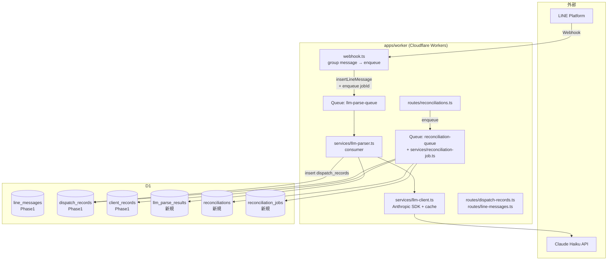
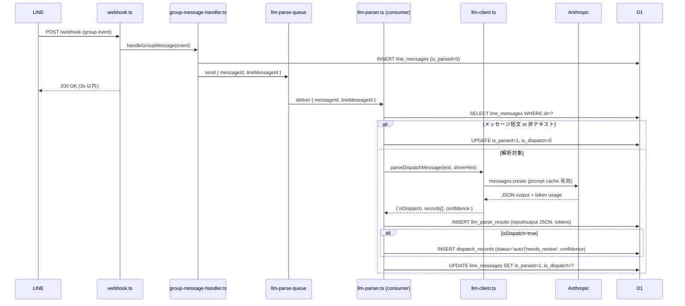
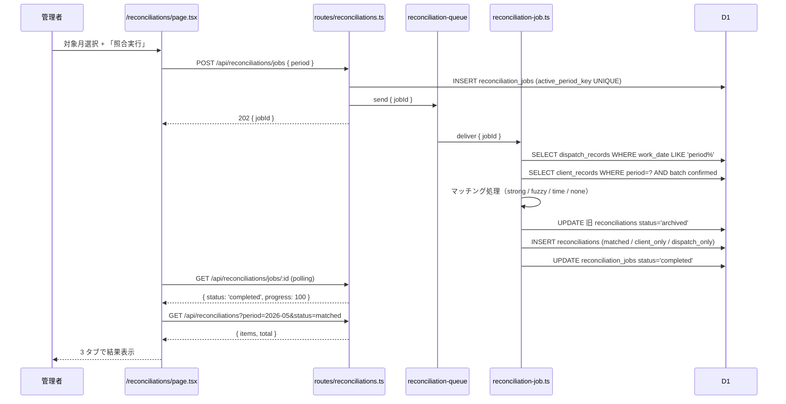

# Design Document — Phase 2 Reconciliation

## Overview

**Purpose**: Phase 1 で蓄積された `line_messages` と `client_records` を、
Claude Haiku LLM による構造化解析 (F2) と自動照合エンジン (F4) で連結し、
3 分類の照合結果（matched / client_only / dispatch_only）を自動算出する。

**Users**: Phase 1 と同じ STEELO 代表（管理者 1 名）。

**Impact**: Phase 1 の F1（蓄積）/ F3（取込）/ F6（明細）はそのまま。
Phase 2 で `dispatch_records` を **LLM が自動投入** するようになり、
`reconciliations` 画面で月初の照合作業が大幅に短縮される。
LLM API 利用で月 ¥500-1,500 のコストが新規に発生。

### Goals

- LINE メッセージ受信から 5 分以内に dispatch_records を自動構造化
- ゴールデンセットで is_dispatch F1 ≥ 0.9, フィールド一致率 ≥ 0.85
- 月 1,000 件規模の照合を 60 秒以内に完了
- LLM API コストを Anthropic prompt caching で 50% 以上削減
- Phase 1 のテスト・運用品質を維持

### Non-Goals

- 異常検知の高度化（金額異常の閾値学習等は Phase 3）
- 配車メッセージ送信側（元請け）への通知・確認フロー
- LLM モデルの fine-tune / 自前 LLM 運用
- 過去 LINE メッセージの一括再解析（運用ツールとして手動 trigger は提供する）

## Boundary Commitments

### This Spec Owns

- `services/llm-client.ts`（Anthropic SDK ラッパー + prompt caching）
- `services/llm-prompts.ts`（バージョン管理されたシステムプロンプト）
- `services/llm-parser.ts`（line_message → dispatch_records への変換）
- `services/reconciliation.ts`（照合アルゴリズム）
- `services/reconciliation-job.ts`（非同期照合ジョブ）
- 新規テーブル: `llm_parse_results`, `reconciliations`, `reconciliation_jobs`
- 新規ルート: `/api/llm-parse/*`, `/api/reconciliations/*`
- 新規 Web 画面: `/reconciliations`

### Out of Boundary

- Phase 1 の `dispatch_records` 手動 CRUD（既存挙動を維持、新規追加なし）
- Phase 1 の `excel-import` / `payment-summaries`（変更なし）
- `friends` / `scenarios` 等の既存 LINE Harness 機能

### Allowed Dependencies

- `@anthropic-ai/sdk`: Claude Haiku 呼び出し（新規追加）
- `@line-crm/db`, `@line-crm/shared`: 既存
- `xlsx`, `jszip`: Phase 1 から流用、追加変更なし

## Architecture



### Technology Stack 追加

| Layer | Choice | Role | Notes |
|---|---|---|---|
| LLM | Anthropic Claude Haiku (`claude-3-haiku-20240307`) | 配車メッセージ解析 | 月 1,000 件で約 ¥500-1,500 |
| LLM SDK | `@anthropic-ai/sdk` 最新 | API クライアント | prompt caching を有効化 |
| Queue (LLM) | Cloudflare Queues `llm-parse-queue` | LINE 受信 → LLM 解析の非同期化 | Phase 1 fallback と同じく Scheduled 経由でも消化可能 |
| Queue (照合) | Cloudflare Queues `reconciliation-queue` | 月次照合の非同期化 | 同上 |
| Secret | `ANTHROPIC_API_KEY` | wrangler secret | env.production にも投入 |

### F2 LLM 解析フロー



### F4 照合フロー



## Components and Interfaces

| Component | Layer | Intent | Req Coverage |
|---|---|---|---|
| `llm-client.ts` | Worker / Services | Anthropic SDK ラッパー、prompt caching | 1.7, 5.4, 6.4 |
| `llm-prompts.ts` | Worker / Services | system prompt のバージョン管理 | 5.3 |
| `llm-parser.ts` | Worker / Services | line_message → dispatch_records 変換 + DB 書込 | 1.1-1.9 |
| `reconciliation.ts` | Worker / Services | マッチングアルゴリズム（純粋関数） | 2.1-2.7 |
| `reconciliation-job.ts` | Worker / Services | 月次照合ジョブの consumer | 2.1, 2.4, 2.6, 6.2 |
| `routes/reconciliations.ts` | Worker / Routes | ジョブ投入 / 結果取得 / レビュー API | 3.1-3.7 |
| `routes/llm-parse.ts` | Worker / Routes | 手動再解析 trigger / 統計取得 | 1.6, 5.4 |
| `db/llm-parse-results.ts` | DB | llm_parse_results CRUD | 1.5, 1.8 |
| `db/reconciliations.ts` | DB | reconciliations CRUD + jobs | 2.3, 2.4, 7.1 |
| `web/reconciliations/page.tsx` | Web / UI | 3 タブの照合結果画面 + 手動マッチング | 3.1-3.6 |

### Service: llm-client.ts

```ts
export interface LLMParseRequest {
  text: string;
  driverHint?: { id: string; name: string }; // group_id から解決した driver
  receivedAt: string;
}

export interface LLMParseResponse {
  isDispatch: boolean;
  records: LLMDispatchRecord[];
  confidence: 'high' | 'medium' | 'low';
  tokenUsage: { input: number; output: number; costUsd: number };
  rawJson: string;
}

export interface LLMDispatchRecord {
  driverName: string | null; // メッセージ中の "{name}さん" 等
  workDate: string | null;   // "YYYY-MM-DD"
  taskNumber: number | null;
  taskName: string | null;
  pickupLocation: string | null;
  deliveryLocation: string | null;
  startTime: string | null;
  endTime: string | null;
  managementNumber: string | null;
}

export async function parseDispatchMessage(
  client: Anthropic, // injected for testability
  req: LLMParseRequest,
  promptVersion: number
): Promise<LLMParseResponse>;
```

### Service: reconciliation.ts

```ts
export type MatchMethod = 'strong' | 'fuzzy' | 'time' | 'none' | 'manual';
export type MatchStatus = 'matched' | 'client_only' | 'dispatch_only';

export interface MatchInput {
  dispatches: DispatchRecordRow[];
  clientRecords: ClientRecordRow[];
}

export interface MatchResultRow {
  dispatchId: string | null;
  clientRecordId: string | null;
  matchStatus: MatchStatus;
  matchMethod: MatchMethod;
  matchScore: number; // 0-1
  warnings: string[];
}

export function reconcile(input: MatchInput): MatchResultRow[];
```

純粋関数として実装し、入力に対して決定論的にマッチング結果を返す。
ユニットテストで境界ケース（同日同名、同日別タスク、時刻違い、重複案件等）を網羅。

## Data Models

migration `047_phase2_reconciliation.sql`:

```sql
-- LLM 解析結果（監査・回帰検証用）
CREATE TABLE IF NOT EXISTS llm_parse_results (
  id              TEXT PRIMARY KEY,
  line_message_id TEXT NOT NULL REFERENCES line_messages (id) ON DELETE CASCADE,
  model_name      TEXT NOT NULL,
  prompt_version  INTEGER NOT NULL,
  input_json      TEXT NOT NULL,
  output_json     TEXT,
  status          TEXT NOT NULL,         -- success/failed
  error_message   TEXT,
  token_input     INTEGER,
  token_output    INTEGER,
  cost_usd        REAL,
  created_at      TEXT NOT NULL DEFAULT (strftime('%Y-%m-%dT%H:%M:%f', 'now', '+9 hours')),
  UNIQUE (line_message_id)
);
CREATE INDEX IF NOT EXISTS idx_llm_parse_status_time ON llm_parse_results (status, created_at DESC);

-- 照合結果
CREATE TABLE IF NOT EXISTS reconciliations (
  id                 TEXT PRIMARY KEY,
  period             TEXT NOT NULL,
  reconciliation_job_id TEXT REFERENCES reconciliation_jobs (id) ON DELETE SET NULL,
  dispatch_id        TEXT REFERENCES dispatch_records (id) ON DELETE SET NULL,
  client_record_id   TEXT REFERENCES client_records (id) ON DELETE SET NULL,
  match_status       TEXT NOT NULL,      -- matched/client_only/dispatch_only
  match_method       TEXT NOT NULL,      -- strong/fuzzy/time/none/manual
  match_score        REAL NOT NULL DEFAULT 0,
  warnings           TEXT,               -- JSON 配列
  status             TEXT NOT NULL DEFAULT 'active', -- active/archived/archived_reviewed
  reviewed           INTEGER NOT NULL DEFAULT 0,
  reviewed_at        TEXT,
  reviewed_by        TEXT,
  notes              TEXT,
  created_at         TEXT NOT NULL DEFAULT (strftime('%Y-%m-%dT%H:%M:%f', 'now', '+9 hours'))
);
CREATE INDEX IF NOT EXISTS idx_recons_period_status ON reconciliations (period, status, match_status);
CREATE INDEX IF NOT EXISTS idx_recons_dispatch ON reconciliations (dispatch_id);
CREATE INDEX IF NOT EXISTS idx_recons_client ON reconciliations (client_record_id);

-- 照合ジョブ
CREATE TABLE IF NOT EXISTS reconciliation_jobs (
  id                TEXT PRIMARY KEY,
  period            TEXT NOT NULL,
  status            TEXT NOT NULL DEFAULT 'queued',
  progress          INTEGER NOT NULL DEFAULT 0,
  dispatch_count    INTEGER NOT NULL DEFAULT 0,
  client_count      INTEGER NOT NULL DEFAULT 0,
  matched_count     INTEGER NOT NULL DEFAULT 0,
  client_only_count INTEGER NOT NULL DEFAULT 0,
  dispatch_only_count INTEGER NOT NULL DEFAULT 0,
  error_message     TEXT,
  requested_by      TEXT NOT NULL,
  requested_at      TEXT NOT NULL DEFAULT (strftime('%Y-%m-%dT%H:%M:%f', 'now', '+9 hours')),
  started_at        TEXT,
  completed_at      TEXT,
  active_period_key TEXT GENERATED ALWAYS AS (
    CASE WHEN status IN ('queued', 'running') THEN period END
  ) VIRTUAL,
  UNIQUE (active_period_key)
);
CREATE INDEX IF NOT EXISTS idx_recon_jobs_period_status ON reconciliation_jobs (period, status);
```

## Error Handling

| 場面 | 種別 | 戦略 |
|---|---|---|
| LLM API timeout / 5xx | リトライ | exponential backoff 1s/5s/30s/5min、4 回失敗で `failed` |
| LLM rate limit (429) | リトライ | 30s 待機後再試行、引き続き 429 なら次回 cron まで延期 |
| LLM JSON 解析失敗 | エラー | output_json は保存、status=failed、is_parsed は更新しない |
| reconcile 中の D1 失敗 | エラー | job を `failed` に倒し error_message に記録 |
| Anthropic 認証失敗 (401) | エラー | リトライせず即 failed、運用通知（Slack 等は Phase 3） |

## Security Considerations

- `ANTHROPIC_API_KEY` は wrangler secret で管理、ログ・audit_logs には含めない
- LLM 入力に氏名・支払金額は含めない（メッセージ本文と driverHint のみ）
- prompt caching を使うとプロンプトが Anthropic 側に 5 分キャッシュされるため、
  プロンプトには PII を入れない（メッセージ本文の PII は仕方ないが追加で混ぜない）
- 監査ログに LLM 呼び出しの actor / token usage を記録

## Performance & Scalability

- LLM 呼び出し: 1 件あたり 2-5 秒、月 1,000 件で累計 30-80 分 →
  Queues 並列度 5 で 10-15 分以内に完了
- 照合エンジン: 月 1,000 件 × 1,000 件 = 100 万比較、JS のループで 60 秒以内に完了
  （strong match 候補を index で絞ってから比較）
- prompt caching で同一プロンプト + 連続メッセージのコスト 50% 削減を目標

## Testing Strategy

### Unit Tests

- `reconciliation.ts`: マッチングアルゴリズムの境界（5-7 ケース）
- `llm-parser.ts`: モック Anthropic クライアントで input/output 検証
- `llm-prompts.ts`: バージョン番号、JSON Schema、token 上限
- `reconciliation-job.ts`: ジョブ進捗計算

### Integration Tests

- LINE webhook → llm-parse-queue enqueue → dispatch_records 作成 までの一気通貫
- 月次照合 → reconciliations 3 分類 → 手動マッチで状態遷移
- 同 period の照合ジョブ二重投入が 409

### Golden Set Tests

- `tests/fixtures/llm-golden.json`: 30 件の人手アノテーション付き LINE メッセージ
- `pnpm -F worker test:golden` で F1 / フィールド一致率を計算
- target: is_dispatch F1 ≥ 0.9, フィールド一致率 ≥ 0.85

## Migration & Rollout

1. `047_phase2_reconciliation.sql` を staging に適用
2. `ANTHROPIC_API_KEY` secret を staging に投入
3. ゴールデンセットでベンチ実行、SLO 達成を確認
4. 過去 1 ヶ月分の LINE メッセージを手動で再解析（運用ツール）
5. ステージング上で 1 ヶ月分の照合を実行し、目視で 3 分類の妥当性を確認
6. 本番へロールアウト

---

_Phase 2 完了時点で STEELO は「LINE → LLM 自動解析 → 元請け Excel との自動照合 →
支払明細自動生成」の完全自動化に到達する。Phase 3 では異常検知、レポート生成、
スコア学習を予定。_
