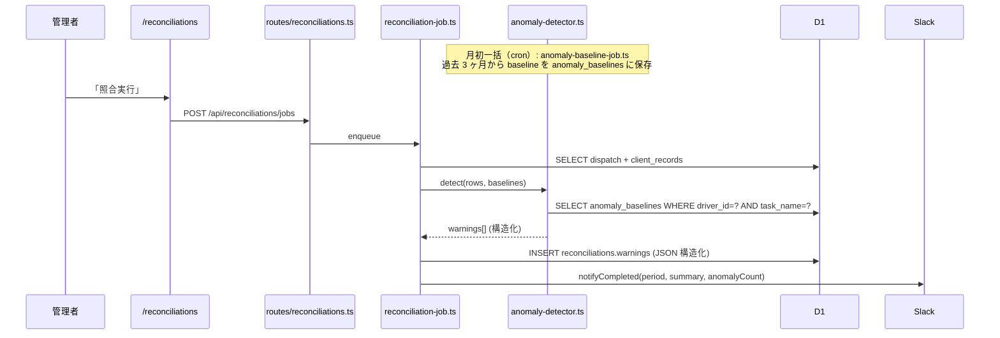
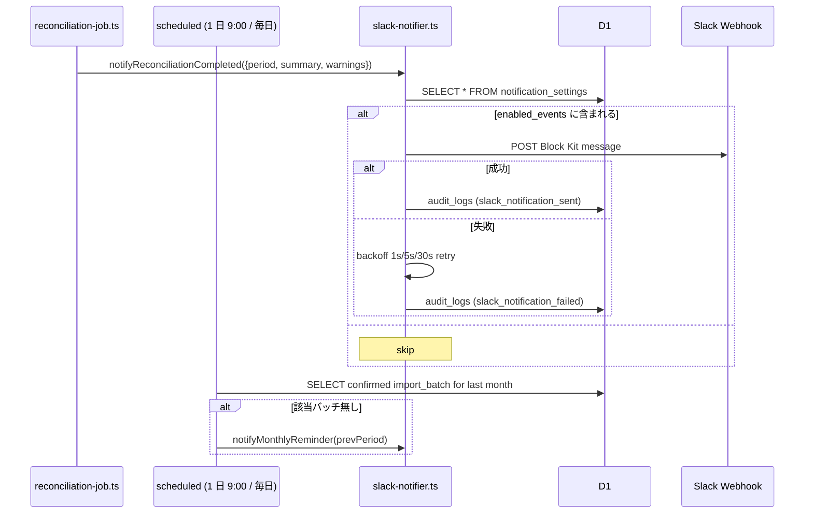
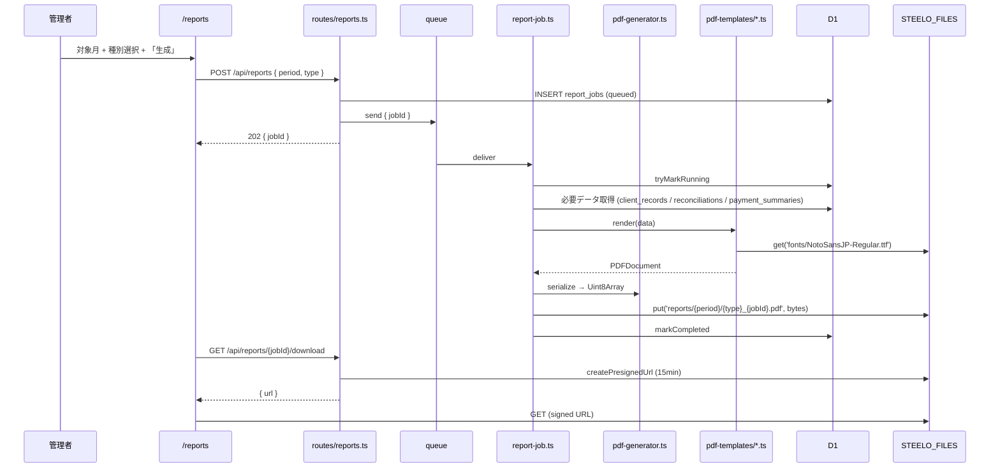

# Design Document — Phase 3 Intelligence

## Overview

**Purpose**: Phase 2 で完成した自動照合パイプラインの上に、(1) 異常検知の精度向上、
(2) Slack による能動通知、(3) 月次 PDF レポート自動生成 を追加し、月初の運用負荷を
更に削減する。

**Users**: Phase 1〜2 と同じ STEELO 代表（管理者 1 名）+ Slack で通知を受ける関係者
（経理、ドライバー総括）。

**Impact**:
- 月初照合作業の所要時間が「画面を開いて確認」→「Slack で完了通知 + 異常があれば
  すぐ画面へ」に短縮（5 分 → 30 秒）
- 元請けへの月次レポートが「Excel から手作業で PDF 化」→「ボタン 1 つ」に短縮
- 運賃中央値学習で false positive が約 50% 削減（Phase 2 の固定 50% 閾値を学習化）

### Goals

- 異常検知 false positive ≤ 30%（Phase 2: ~60%）
- Slack 通知の遅延 ≤ 5 秒（照合完了 → 投稿）
- 200 行規模の PDF レポートを 30 秒以内に生成
- Phase 1+2 テスト 561 件を 1 件も壊さない

### Non-Goals

- 異常検知の機械学習化（中央値 + SD で十分、ML は Phase 4 以降）
- Slack 以外の通知チャネル
- 元請けごとにカスタムする PDF テンプレート
- PDF への電子署名・改竄防止

## Boundary Commitments

### This Spec Owns

- `services/anomaly-detector.ts` (純粋関数、ベースライン参照 + warning 生成)
- `services/anomaly-baseline-job.ts` (月次ベースライン再計算ジョブ)
- `services/slack-notifier.ts` (Slack Webhook 投稿)
- `services/pdf-templates/` (各レポート種別の純粋関数テンプレート)
- `services/pdf-generator.ts` (テンプレート + データ → PDFDocument)
- `services/report-job.ts` (PDF 生成ジョブ consumer)
- 新規テーブル: `anomaly_baselines` / `notification_settings` / `report_jobs`
- 新規ルート: `/api/anomaly-baselines/*` / `/api/notification-settings/*` /
  `/api/reports/*`
- 新規 Web 画面: `/settings/notifications` / `/reports`
- `reconciliation.ts` の warning 構造化リファクタ（Phase 2 文字列配列 → 構造化配列）

### Out of Boundary

- Phase 2 の照合エンジン本体（マッチング判定ロジック）は変更しない
- Phase 1 の Excel 取込 / 支払明細生成は変更しない
- `audit_logs` の Schema 変更（action 追加のみ）

### Allowed Dependencies

- `pdf-lib` ^1.17 (Workers 互換、Cloudflare 公式ブログで動作確認済)
- `@line-crm/db` / `@line-crm/shared` (既存)
- 既存 R2 / Queues バインディング

## Architecture

```mermaid
graph TB
  subgraph External["外部"]
    Slack[Slack Incoming Webhook]
  end

  subgraph Worker["apps/worker"]
    ReconJob[services/reconciliation-job.ts<br/>Phase 2 既存]
    AnomalyDet[services/anomaly-detector.ts<br/>Phase 3 新規]
    BaselineJob[services/anomaly-baseline-job.ts<br/>Phase 3 新規]
    Slackv[services/slack-notifier.ts<br/>Phase 3 新規]
    PdfGen[services/pdf-generator.ts<br/>Phase 3 新規]
    Templates[services/pdf-templates/<br/>Phase 3 新規]
    ReportJob[services/report-job.ts<br/>Phase 3 新規]
    ScheduledCron[index.ts scheduled<br/>cron extension]
  end

  subgraph DB["D1"]
    Baselines[(anomaly_baselines<br/>新規)]
    NotifSettings[(notification_settings<br/>新規)]
    ReportJobs[(report_jobs<br/>新規)]
    Reconciliations[(reconciliations<br/>warnings 構造変更)]
    ImportBatches[(import_batches<br/>Phase 1 既存)]
  end

  subgraph R2["R2 STEELO_FILES"]
    PDF[reports/{period}/{type}_{jobId}.pdf]
    Fonts[fonts/NotoSansJP-Regular.ttf]
  end

  ReconJob --> AnomalyDet
  AnomalyDet --> Baselines
  AnomalyDet --> Reconciliations
  ReconJob --> Slackv

  ScheduledCron --> BaselineJob
  BaselineJob --> ImportBatches
  BaselineJob --> Baselines

  ScheduledCron --> Slackv
  ScheduledCron -.->|月初リマインド| Slack

  ReportJob --> PdfGen
  PdfGen --> Templates
  PdfGen --> Fonts
  ReportJob --> PDF
  ReportJob --> ReportJobs

  Slackv --> Slack
  Slackv --> NotifSettings
```

### Technology Stack 追加

| Layer | Choice | Role | Notes |
|---|---|---|---|
| PDF | `pdf-lib` ^1.17 | Workers 互換 PDF 生成 | 純 TypeScript、Buffer 依存なし |
| PDF Font | Noto Sans JP (TTF) | 日本語埋込 | R2 に置いて `embedFont` で参照 |
| Slack | Incoming Webhook | 通知投稿 | URL は notification_settings に保存 |
| Queue | 既存 `reconciliation-queue` 流用 | report job consumer も同 queue で | バインディングを `REPORT_QUEUE` で別建てしても可 |
| Cron | 既存 `0 9 1 * *` 追加 | 月初リマインド | Phase 1+2 の `*/5 * * * *` `0 */6 * * *` に追加 |

### F8 異常検知強化フロー



### F9 Slack 通知フロー



### F10 PDF レポート生成フロー



## Components and Interfaces

| Component | Layer | Intent | Req Coverage |
|---|---|---|---|
| `anomaly-detector.ts` | Worker / Services | 純粋関数、baseline + dispatch/client → warnings | 1.1-1.4, 2.1-2.4 |
| `anomaly-baseline-job.ts` | Worker / Services | 月初 cron で baseline 一括再計算 | 1.1, 1.5 |
| `slack-notifier.ts` | Worker / Services | Slack Block Kit 送信 + retry | 3.1-3.4, 4.1-4.5 |
| `pdf-templates/summary.ts` | Worker / Services | 元請けサマリーレポート | 5.1, 6.1 |
| `pdf-templates/reconciliation-report.ts` | Worker / Services | 照合結果レポート | 5.1, 6.1 |
| `pdf-templates/payment-summary.ts` | Worker / Services | 支払明細サマリー | 5.1, 6.1 |
| `pdf-generator.ts` | Worker / Services | テンプレート呼出 + フォント埋込 + serialize | 5.2-5.3, 6.3 |
| `report-job.ts` | Worker / Services | 非同期 PDF ジョブ consumer | 5.4, 7.2 |
| `routes/reports.ts` | Worker / Routes | ジョブ投入 / 状態 / ダウンロード | 5.1-5.4 |
| `routes/notification-settings.ts` | Worker / Routes | GET / PUT 設定 + テスト投稿 | 3.2 |
| `routes/anomaly-baselines.ts` | Worker / Routes | 手動再計算トリガー | 1.5 |
| `db/anomaly-baselines.ts` | DB | baselines CRUD | 1.1, 8.1 |
| `db/notification-settings.ts` | DB | 単一行 settings の get/update | 3.1, 8.1 |
| `db/report-jobs.ts` | DB | report_jobs CRUD + 状態管理 | 5.4, 8.1 |
| `web/settings/notifications/page.tsx` | Web / UI | Slack URL 入力 + イベント選択 + テスト | 3.2 |
| `web/reports/page.tsx` | Web / UI | 月選択 + 種別選択 + ダウンロード | 5.1 |

### Service: anomaly-detector.ts

```ts
export interface Baseline {
  driverId: string;
  taskName: string | null; // null = driver 全体フォールバック
  median: number;
  sd: number;
  sampleSize: number;
}

export interface AnomalyInput {
  dispatch: DispatchRecordRow | null;
  client: ClientRecordRow | null;
  baselines: Map<string, Baseline>; // key: `${driverId}|${taskName ?? '_all_'}`
}

export interface StructuredWarning {
  type:
    | 'fare_deviation_high'
    | 'time_inversion'
    | 'advance_payment_without_label'
    | 'dispatch_overload';
  severity: 'warn' | 'info';
  message: string;
  data: Record<string, unknown>;
}

export function detectAnomalies(input: AnomalyInput): StructuredWarning[];
```

純粋関数として実装。Phase 2 の `reconciliation.ts:collectWarnings` を置き換える。

### Service: slack-notifier.ts

```ts
export type NotificationEvent =
  | 'reconciliation_completed'
  | 'anomaly_detected'        // (内部用、reconciliation_completed に集約)
  | 'monthly_reminder'
  | 'llm_parse_failed_streak';

export interface SlackBlockMessage {
  text: string;       // fallback text
  blocks: unknown[];  // Block Kit
}

export async function sendSlackNotification(
  env: Env['Bindings'],
  event: NotificationEvent,
  message: SlackBlockMessage
): Promise<{ sent: boolean; error?: string }>;

export function buildReconciliationCompletedMessage(input: {
  period: string;
  summary: { matched: number; clientOnly: number; dispatchOnly: number };
  warningCounts: Record<string, number>;
  adminUrl: string;
}): SlackBlockMessage;
```

### Service: pdf-templates/

各テンプレートは純粋関数:

```ts
import { PDFDocument } from 'pdf-lib';

export interface ReconciliationReportData {
  period: string;
  matched: ReconciliationRow[];
  clientOnly: ReconciliationRow[];
  dispatchOnly: ReconciliationRow[];
  warnings: { row: ReconciliationRow; warnings: StructuredWarning[] }[];
  generatedAt: string;
  templateVersion: number;
}

export const TEMPLATE_VERSION = 1;

export async function renderReconciliationReport(
  pdf: PDFDocument,
  data: ReconciliationReportData,
  fonts: { regular: PDFFont; bold: PDFFont }
): Promise<void>;
```

## Data Models

migration `048_phase3_intelligence.sql`:

```sql
-- 異常検知ベースライン
CREATE TABLE IF NOT EXISTS anomaly_baselines (
  id             TEXT PRIMARY KEY,
  driver_id      TEXT NOT NULL REFERENCES drivers (id) ON DELETE CASCADE,
  task_name      TEXT,                          -- NULL = driver 全体フォールバック
  median_fare    REAL NOT NULL,
  sd_fare        REAL NOT NULL,
  sample_size    INTEGER NOT NULL,
  period_from    TEXT NOT NULL,                 -- "YYYY-MM"
  period_to      TEXT NOT NULL,
  computed_at    TEXT NOT NULL DEFAULT (strftime('%Y-%m-%dT%H:%M:%f', 'now', '+9 hours')),
  UNIQUE (driver_id, task_name)
);
CREATE INDEX IF NOT EXISTS idx_anomaly_baselines_driver
  ON anomaly_baselines (driver_id, task_name);

-- 通知設定（単一行）
CREATE TABLE IF NOT EXISTS notification_settings (
  id                  INTEGER PRIMARY KEY CHECK (id = 1),
  slack_webhook_url   TEXT,
  enabled_events      TEXT NOT NULL DEFAULT '[]',  -- JSON
  mention_users       TEXT NOT NULL DEFAULT '{}',  -- JSON
  last_test_at        TEXT,
  last_error          TEXT,
  updated_at          TEXT NOT NULL DEFAULT (strftime('%Y-%m-%dT%H:%M:%f', 'now', '+9 hours'))
);
INSERT OR IGNORE INTO notification_settings (id) VALUES (1);

-- レポート生成ジョブ
CREATE TABLE IF NOT EXISTS report_jobs (
  id                TEXT PRIMARY KEY,
  period            TEXT NOT NULL,
  report_type       TEXT NOT NULL,           -- 'client_summary' | 'reconciliation' | 'payment_summary'
  status            TEXT NOT NULL DEFAULT 'queued',
  template_version  INTEGER NOT NULL,
  r2_key            TEXT,                    -- 完了後に埋まる
  byte_size         INTEGER,
  error_message     TEXT,
  requested_by      TEXT NOT NULL,
  requested_at      TEXT NOT NULL DEFAULT (strftime('%Y-%m-%dT%H:%M:%f', 'now', '+9 hours')),
  started_at        TEXT,
  completed_at      TEXT
);
CREATE INDEX IF NOT EXISTS idx_report_jobs_period_status
  ON report_jobs (period, status, requested_at DESC);
```

`reconciliations.warnings` の Schema は **変更しない**（TEXT のまま、中身が
JSON 配列で要素構造だけ拡張）。コード側で `parseWarnings` ヘルパで吸収する。

## Error Handling

| 場面 | 種別 | 戦略 |
|---|---|---|
| Slack Webhook 4xx (URL 無効等) | エラー | リトライせず即 failed、notification_settings.last_error に記録 |
| Slack Webhook 5xx / timeout | リトライ | exp backoff 1s/5s/30s、3 回失敗で failed |
| PDF 生成中の R2 取得失敗 (フォント) | エラー | job を failed に倒し error_message にスタック記録 |
| PDF 生成中の D1 タイムアウト | エラー | 同上、リカバリは手動再投入 |
| Baseline 計算で 0 件 | スキップ | INSERT せず、log のみ |

## Security Considerations

- `notification_settings.slack_webhook_url` は **D1 に平文保存**するが、`/api`
  経由でも値そのものは GET で返さない（マスク表示: `https://hooks.slack.com/services/T***/B***/***`）。
  PUT で書き換え可能のみ。`audit_logs.payload` には URL を含めない
- PDF 生成バイナリは R2 に置き、15 分有効の signed URL でしか配信しない
- レポートに PII (ドライバー名) が含まれるため、ダウンロード URL はログに残さない
- Slack 投稿時にメッセージ中に dispatch_records.task_name 等がそのまま出るが、
  これは想定運用（社内 Slack）。社外向け Slack の場合は別途マスキング検討

## Performance & Scalability

- **異常検知**: 1 reconciliation 行あたり O(1) (Map lookup)、1000 行で 10ms 以下
- **Baseline 計算**: 月初 cron で 1 回、3 ヶ月 × 1000 行 × N drivers で
  D1 → JS で 5 秒程度
- **PDF 生成**: 200 行で 5-10 秒（pdf-lib + Noto Sans JP 埋込）、CPU 制限 30 秒内
- **Slack 通知**: 1 req ≤ 5 秒（Slack 側 SLA）

## Testing Strategy

### Unit Tests

- `anomaly-detector.ts`: 4 warning タイプ × 境界ケース（baseline 有無 / time-only /
  date 跨ぎ / 多重 warning）= 10+ ケース
- `slack-notifier.ts`: モック fetch で正常 / 4xx / 5xx / retry 回数 = 6 ケース
- `pdf-templates/*.ts`: snapshot test で生成された PDF の page 数 / フォント埋込確認
- `pdf-generator.ts`: フォント取得失敗 / 巨大データ（500 行）

### Integration Tests

- reconciliation job → anomaly-detector → warnings JSON 構造化保存
- baseline job → anomaly_baselines INSERT
- report job → R2 PUT → signed URL 取得
- notification_settings: PUT → テスト投稿 fire / GET でマスク表示

### E2E Tests (wrangler dev)

- 実 Slack webhook (テスト用 channel) に投稿される
- 実 R2 に PDF が保存される + ダウンロード可能

## Migration & Rollout

1. `048_phase3_intelligence.sql` を staging に適用
2. Noto Sans JP TTF を R2 `fonts/` に手動アップロード
3. 既存 `reconciliations.warnings` の文字列配列を構造化に再計算
   （`scripts/migrate-warnings.ts` 実行、optional）
4. Slack Webhook URL を staging で取得 → notification_settings に投入
5. ステージングで 1 ヶ月分の照合 → Slack 通知 + PDF 生成を一気通貫で確認
6. 本番へ rollout

---

_Phase 3 完了時点で STEELO は「データを蓄積する」業務システムから「異常を察知して
能動的に教えてくれる」業務支援システムへ進化する。Phase 4 では機械学習による
スコア改善 / マルチテナント化 を予定。_
