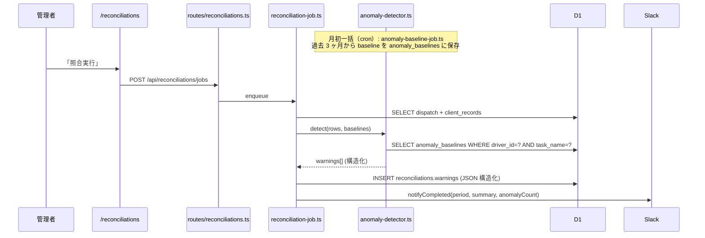
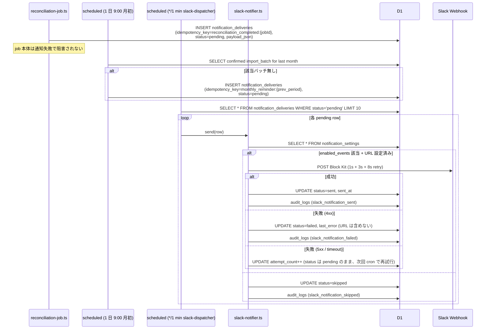
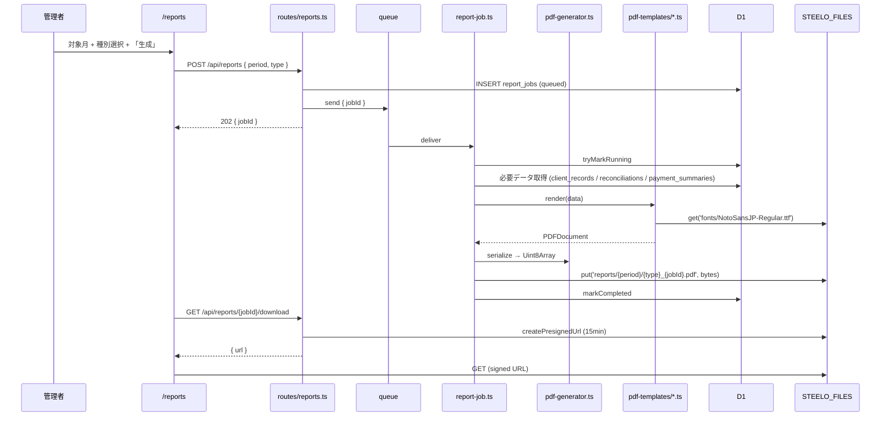

# Design Document — Phase 3 Intelligence

## Overview

**Purpose**: Phase 2 で完成した自動照合パイプラインの上に、(1) 異常検知の精度向上、
(2) Slack による能動通知、(3) 月次 PDF レポート自動生成 を追加し、月初の運用負荷を
更に削減する。

**Users**: Phase 1〜2 と同じ STEELO 代表（管理者 1 名）+ Slack で通知を受ける関係者
（経理、ドライバー総括）。

**Impact**:
- 月初照合作業の所要時間が「画面を開いて確認」→「Slack で完了通知 + 異常があれば
  すぐ画面へ」に短縮（5 分 → 30 秒）
- 元請けへの月次レポートが「Excel から手作業で PDF 化」→「ボタン 1 つ」に短縮
- 運賃中央値学習で false positive が約 50% 削減（Phase 2 の固定 50% 閾値を学習化）

### Goals

- 異常検知 false positive ≤ 30%（Phase 2: ~60%）
- Slack 通知の遅延 ≤ 5 秒（照合完了 → 投稿）
- 200 行規模の PDF レポートを 30 秒以内に生成
- Phase 1+2 テスト 561 件を 1 件も壊さない

### Non-Goals

- 異常検知の機械学習化（中央値 + SD で十分、ML は Phase 4 以降）
- Slack 以外の通知チャネル
- 元請けごとにカスタムする PDF テンプレート
- PDF への電子署名・改竄防止

## Boundary Commitments

### This Spec Owns

- `services/anomaly-detector.ts` (純粋関数、ベースライン参照 + warning 生成)
- `services/anomaly-baseline-job.ts` (月次ベースライン再計算ジョブ)
- `services/slack-notifier.ts` (Slack Webhook 投稿)
- `services/pdf-templates/` (各レポート種別の純粋関数テンプレート)
- `services/pdf-generator.ts` (テンプレート + データ → PDFDocument)
- `services/report-job.ts` (PDF 生成ジョブ consumer)
- 新規テーブル: `anomaly_baselines` / `notification_settings` / `report_jobs`
- 新規ルート: `/api/anomaly-baselines/*` / `/api/notification-settings/*` /
  `/api/reports/*`
- 新規 Web 画面: `/settings/notifications` / `/reports`
- `reconciliation.ts` の warning 構造化リファクタ（Phase 2 文字列配列 → 構造化配列）

### Out of Boundary

- Phase 2 の照合エンジン本体（マッチング判定ロジック）は変更しない
- Phase 1 の Excel 取込 / 支払明細生成は変更しない
- `audit_logs` の Schema 変更（action 追加のみ）

### Allowed Dependencies

- `pdf-lib` ^1.17 (Workers 互換、Cloudflare 公式ブログで動作確認済)
- **`@pdf-lib/fontkit` ^1.1** (Codex Phase 3 review CRITICAL #3 反映:
  日本語フォント等の custom font 埋込に必須。`pdfDoc.registerFontkit(fontkit)`
  を呼ばないと `embedFont(ttfBytes)` が標準フォント以外で失敗する)
- `@line-crm/db` / `@line-crm/shared` (既存)
- 既存 R2 / Queues バインディング

## Architecture

```mermaid
graph TB
  subgraph External["外部"]
    Slack[Slack Incoming Webhook]
  end

  subgraph Worker["apps/worker"]
    ReconJob[services/reconciliation-job.ts<br/>Phase 2 既存]
    AnomalyDet[services/anomaly-detector.ts<br/>Phase 3 新規]
    BaselineJob[services/anomaly-baseline-job.ts<br/>Phase 3 新規]
    Slackv[services/slack-notifier.ts<br/>Phase 3 新規]
    PdfGen[services/pdf-generator.ts<br/>Phase 3 新規]
    Templates[services/pdf-templates/<br/>Phase 3 新規]
    ReportJob[services/report-job.ts<br/>Phase 3 新規]
    ScheduledCron[index.ts scheduled<br/>cron extension]
  end

  subgraph DB["D1"]
    Baselines[(anomaly_baselines<br/>新規)]
    NotifSettings[(notification_settings<br/>新規)]
    ReportJobs[(report_jobs<br/>新規)]
    Reconciliations[(reconciliations<br/>warnings 構造変更)]
    ImportBatches[(import_batches<br/>Phase 1 既存)]
  end

  subgraph R2["R2 STEELO_FILES"]
    PDF[reports/{period}/{type}_{jobId}.pdf]
    Fonts[fonts/NotoSansJP-Regular.ttf]
  end

  ReconJob --> AnomalyDet
  AnomalyDet --> Baselines
  AnomalyDet --> Reconciliations
  ReconJob --> Slackv

  ScheduledCron --> BaselineJob
  BaselineJob --> ImportBatches
  BaselineJob --> Baselines

  ScheduledCron --> Slackv
  ScheduledCron -.->|月初リマインド| Slack

  ReportJob --> PdfGen
  PdfGen --> Templates
  PdfGen --> Fonts
  ReportJob --> PDF
  ReportJob --> ReportJobs

  Slackv --> Slack
  Slackv --> NotifSettings
```

### Technology Stack 追加

| Layer | Choice | Role | Notes |
|---|---|---|---|
| PDF | `pdf-lib` ^1.17 + `@pdf-lib/fontkit` ^1.1 | Workers 互換 PDF 生成 | fontkit は日本語フォント embedFont の前提条件 |
| PDF Font | Noto Sans JP (TTF) | 日本語埋込 | R2 `fonts/NotoSansJP-Regular.ttf`、起動時取得失敗は job を failed に倒す |
| Slack | Incoming Webhook | 通知投稿 | URL は notification_settings に保存 (D1 EAR + マスク表示) |
| Queue (report) | **`REPORT_QUEUE` (新規、別 queue)** | report job 専用 (Codex CRITICAL #7) | reconciliation-queue 流用すると consumer 分岐が壊れるため別建て。DLQ は `report-dlq` |
| Notification 再送 | **cron `*/1 * * * *`** | `notification_deliveries.status='pending'` の Slack 再送 | reconciliation-job からは Slack 直接呼び出さない (CRITICAL #5) |
| Cron | 既存に `0 0 1 * *` (UTC) = JST 9:00 月初 追加 | 月初リマインド | Phase 1+2 の `*/5 * * * *` `0 */6 * * *` と並列。冗長起動は `notification_deliveries.idempotency_key` で防ぐ |

### F8 異常検知強化フロー



### F9 Slack 通知フロー

**Codex Phase 3 review CRITICAL #4 / #5 反映**: reconciliation-job からは
Slack を直接呼ばず、`notification_deliveries` に永続化のみする。
実送信は cron `*/1 * * * *` の slack-dispatcher が `pending` 行を拾って実行。
`waitUntil` 30 秒制限内に収まる `1s + 3s + 8s` retry に変更。



**重要**: cron が 1 分粒度なので、照合完了 → Slack 通知の遅延は最大 1 分。これは
許容（Slack 通知はユーザ体感の即時性が必須ではない）。即時性が必要になれば
Phase 4 で `notification-queue` (Cloudflare Queues) に置き換える。

### F10 PDF レポート生成フロー



## Components and Interfaces

| Component | Layer | Intent | Req Coverage |
|---|---|---|---|
| `anomaly-detector.ts` | Worker / Services | 純粋関数、baseline + dispatch/client → warnings | 1.1-1.4, 2.1-2.4 |
| `anomaly-baseline-job.ts` | Worker / Services | 月初 cron で baseline 一括再計算 | 1.1, 1.5 |
| `slack-notifier.ts` | Worker / Services | Slack Block Kit 送信 + retry | 3.1-3.4, 4.1-4.5 |
| `pdf-templates/summary.ts` | Worker / Services | 元請けサマリーレポート | 5.1, 6.1 |
| `pdf-templates/reconciliation-report.ts` | Worker / Services | 照合結果レポート | 5.1, 6.1 |
| `pdf-templates/payment-summary.ts` | Worker / Services | 支払明細サマリー | 5.1, 6.1 |
| `pdf-generator.ts` | Worker / Services | テンプレート呼出 + フォント埋込 + serialize | 5.2-5.3, 6.3 |
| `report-job.ts` | Worker / Services | 非同期 PDF ジョブ consumer | 5.4, 7.2 |
| `routes/reports.ts` | Worker / Routes | ジョブ投入 / 状態 / ダウンロード | 5.1-5.4 |
| `routes/notification-settings.ts` | Worker / Routes | GET / PUT 設定 + テスト投稿 | 3.2 |
| `routes/anomaly-baselines.ts` | Worker / Routes | 手動再計算トリガー | 1.5 |
| `db/anomaly-baselines.ts` | DB | baselines CRUD | 1.1, 8.1 |
| `db/notification-settings.ts` | DB | 単一行 settings の get/update | 3.1, 8.1 |
| `db/report-jobs.ts` | DB | report_jobs CRUD + 状態管理 | 5.4, 8.1 |
| `web/settings/notifications/page.tsx` | Web / UI | Slack URL 入力 + イベント選択 + テスト | 3.2 |
| `web/reports/page.tsx` | Web / UI | 月選択 + 種別選択 + ダウンロード | 5.1 |

### Service: anomaly-detector.ts

**Codex Phase 3 review HIGH #10 反映**: `dispatch_overload` は集計条件
（同 driver × 同日 3 件以上）なので、detector を純粋関数に保つために
`reconciliation-job` が事前集計した `dispatchCountByDriverDate` を渡す形にする。

```ts
export type WarningType =
  | 'fare_deviation_high'
  | 'time_inversion'
  | 'advance_payment_without_dispatch'  // Phase 2 から維持
  | 'advance_payment_without_label'      // Phase 3 新規
  | 'dispatch_overload'
  | 'legacy_warning';                    // 旧 string warning の互換

export interface Baseline {
  driverId: string;
  taskName: string | null;     // null = driver 全体フォールバック
  medianFare: number;
  sdFare: number;
  sampleSize: number;
  baselineScope: 'task' | 'driver_fallback';
}

export interface AnomalyContext {
  /** key: `${driverId}|${taskName ?? '_ALL_'}` */
  baselines: Map<string, Baseline>;
  /** key: `${driverId}|${YYYY-MM-DD}`、Codex HIGH #10 反映 */
  dispatchCountByDriverDate: Map<string, number>;
  fareDeviationThresholdSigma?: number; // default 2.0
}

export interface AnomalyInput {
  dispatch: DispatchRecordRow | null;
  client: ClientRecordRow | null;
  context: AnomalyContext;
}

export interface StructuredWarning {
  type: WarningType;
  severity: 'warn' | 'info';
  message: string;
  data: Record<string, unknown>;
}

export function detectAnomalies(input: AnomalyInput): StructuredWarning[];
```

純粋関数として実装。Phase 2 の `reconciliation.ts:collectWarnings` を置き換える。

### Service: parse-warnings.ts

**Codex Phase 3 review CRITICAL #2 反映**: 旧 Phase 2 文字列配列 warning との
後方互換を吸収するヘルパ。API/UI/PDF 層は必ずこれを経由して読み出す。

```ts
const LEGACY_PREFIX_MAP: Array<[RegExp, WarningType, 'warn' | 'info']> = [
  [/^fare_deviation:/, 'fare_deviation_high', 'warn'],
  [/^advance_payment_without_dispatch$/, 'advance_payment_without_dispatch', 'info'],
];

/**
 * `reconciliations.warnings` (TEXT JSON 配列) を構造化配列に正規化する。
 *
 * - null / 空文字 → []
 * - 旧 `string[]` → 各要素を legacy_warning か mapped type に変換
 * - 新 `StructuredWarning[]` → そのまま返す (validate のみ)
 */
export function parseWarnings(raw: string | null): StructuredWarning[];

/** 書き込み時用: StructuredWarning[] を JSON 文字列に */
export function serializeWarnings(warnings: StructuredWarning[]): string | null;
```

### Service: slack-notifier.ts

```ts
export type NotificationEvent =
  | 'reconciliation_completed'
  | 'anomaly_detected'        // (内部用、reconciliation_completed に集約)
  | 'monthly_reminder'
  | 'llm_parse_failed_streak';

export interface SlackBlockMessage {
  text: string;       // fallback text
  blocks: unknown[];  // Block Kit
}

export async function sendSlackNotification(
  env: Env['Bindings'],
  event: NotificationEvent,
  message: SlackBlockMessage
): Promise<{ sent: boolean; error?: string }>;

export function buildReconciliationCompletedMessage(input: {
  period: string;
  summary: { matched: number; clientOnly: number; dispatchOnly: number };
  warningCounts: Record<string, number>;
  adminUrl: string;
}): SlackBlockMessage;
```

### Service: pdf-templates/

各テンプレートは純粋関数:

```ts
import { PDFDocument } from 'pdf-lib';

export interface ReconciliationReportData {
  period: string;
  matched: ReconciliationRow[];
  clientOnly: ReconciliationRow[];
  dispatchOnly: ReconciliationRow[];
  warnings: { row: ReconciliationRow; warnings: StructuredWarning[] }[];
  generatedAt: string;
  templateVersion: number;
}

export const TEMPLATE_VERSION = 1;

export async function renderReconciliationReport(
  pdf: PDFDocument,
  data: ReconciliationReportData,
  fonts: { regular: PDFFont; bold: PDFFont }
): Promise<void>;
```

## Data Models

migration `048_phase3_intelligence.sql`:

```sql
-- 異常検知ベースライン
CREATE TABLE IF NOT EXISTS anomaly_baselines (
  id             TEXT PRIMARY KEY,
  driver_id      TEXT NOT NULL REFERENCES drivers (id) ON DELETE CASCADE,
  task_name      TEXT,                          -- NULL = driver 全体フォールバック
  median_fare    REAL NOT NULL,
  sd_fare        REAL NOT NULL,
  sample_size    INTEGER NOT NULL,
  baseline_scope TEXT NOT NULL,                 -- 'task' | 'driver_fallback'
  period_from    TEXT NOT NULL,                 -- "YYYY-MM"
  period_to      TEXT NOT NULL,
  computed_at    TEXT NOT NULL DEFAULT (strftime('%Y-%m-%dT%H:%M:%f', 'now', '+9 hours'))
);
-- Codex Phase 3 review HIGH #8 反映:
--   SQLite の UNIQUE は NULL を別値として扱うため、
--   partial unique index で `task_name IS NULL` 行と `IS NOT NULL` 行を別々に一意化
CREATE UNIQUE INDEX IF NOT EXISTS ux_anomaly_baselines_task
  ON anomaly_baselines (driver_id, task_name) WHERE task_name IS NOT NULL;
CREATE UNIQUE INDEX IF NOT EXISTS ux_anomaly_baselines_driver_all
  ON anomaly_baselines (driver_id) WHERE task_name IS NULL;
CREATE INDEX IF NOT EXISTS idx_anomaly_baselines_driver
  ON anomaly_baselines (driver_id, task_name);

-- 通知設定（単一行）
CREATE TABLE IF NOT EXISTS notification_settings (
  id                  INTEGER PRIMARY KEY CHECK (id = 1),
  slack_webhook_url   TEXT,
  enabled_events      TEXT NOT NULL DEFAULT '[]',  -- JSON
  mention_users       TEXT NOT NULL DEFAULT '{}',  -- JSON
  last_test_at        TEXT,
  last_error          TEXT,
  updated_at          TEXT NOT NULL DEFAULT (strftime('%Y-%m-%dT%H:%M:%f', 'now', '+9 hours'))
);
INSERT OR IGNORE INTO notification_settings (id) VALUES (1);

-- 通知の送信記録 + 再送キュー (Codex Phase 3 review HIGH #13 反映)
CREATE TABLE IF NOT EXISTS notification_deliveries (
  id                TEXT PRIMARY KEY,
  idempotency_key   TEXT NOT NULL UNIQUE,        -- 例: reconciliation_completed:{jobId}
  event_type        TEXT NOT NULL,               -- reconciliation_completed | monthly_reminder | llm_parse_failed_streak
  status            TEXT NOT NULL DEFAULT 'pending', -- pending | sent | failed | skipped
  attempt_count     INTEGER NOT NULL DEFAULT 0,
  payload_json      TEXT NOT NULL,               -- Slack Block Kit 構造そのまま
  last_error        TEXT,                        -- URL 本体は含めない (status + path 末尾のみ)
  requested_at      TEXT NOT NULL DEFAULT (strftime('%Y-%m-%dT%H:%M:%f', 'now', '+9 hours')),
  sent_at           TEXT,
  next_retry_at     TEXT                         -- pending で次回試行可能になる時刻
);
CREATE INDEX IF NOT EXISTS idx_notification_deliveries_pending
  ON notification_deliveries (status, next_retry_at) WHERE status = 'pending';

-- レポート生成ジョブ
CREATE TABLE IF NOT EXISTS report_jobs (
  id                            TEXT PRIMARY KEY,
  period                        TEXT NOT NULL,
  report_type                   TEXT NOT NULL,           -- 'reconciliation' (P0) | 'client_summary' (P1) | 'payment_summary' (P2)
  status                        TEXT NOT NULL DEFAULT 'queued',
  template_version              INTEGER NOT NULL,
  r2_key                        TEXT,                    -- 完了後に埋まる
  byte_size                     INTEGER,
  page_count                    INTEGER,
  -- Codex Phase 3 review MEDIUM #19 反映: 生成元データの identity snapshot
  source_import_batch_id        TEXT REFERENCES import_batches (id) ON DELETE SET NULL,
  source_reconciliation_job_id  TEXT REFERENCES reconciliation_jobs (id) ON DELETE SET NULL,
  source_payment_job_id         TEXT REFERENCES payment_jobs (id) ON DELETE SET NULL,
  error_message                 TEXT,
  requested_by                  TEXT NOT NULL,
  requested_at                  TEXT NOT NULL DEFAULT (strftime('%Y-%m-%dT%H:%M:%f', 'now', '+9 hours')),
  started_at                    TEXT,
  completed_at                  TEXT,
  -- Codex Phase 3 review CRITICAL #6 反映: 同 period × type の重複起動排他
  active_report_key             TEXT GENERATED ALWAYS AS (
    CASE WHEN status IN ('queued', 'running') THEN period || ':' || report_type END
  ) VIRTUAL,
  UNIQUE (active_report_key)
);
CREATE INDEX IF NOT EXISTS idx_report_jobs_period_status
  ON report_jobs (period, status, requested_at DESC);
```

`reconciliations.warnings` の Schema は **変更しない**（TEXT のまま、中身が
JSON 配列で要素構造だけ拡張）。コード側で `services/parse-warnings.ts` の
`parseWarnings()` ヘルパで読み出し時に互換吸収する (Codex CRITICAL #2)。

## Error Handling

| 場面 | 種別 | 戦略 |
|---|---|---|
| Slack Webhook 4xx (URL 無効等) | エラー | リトライせず `notification_deliveries.status='failed'`、`last_error` に HTTP status + path 末尾のみ記録 (URL 本体は含めない) |
| Slack Webhook 5xx / timeout | リトライ | exp backoff **1s/3s/8s = 12s 以内 (waitUntil 30s 制限内)**、3 回失敗時は `status='pending'` を維持して `next_retry_at` を +5 分後に設定、次回 cron で再試行 |
| Slack notifier 累積 retry > 24h | エラー | `status='failed'` に倒し、`audit_logs.slack_notification_failed` を記録 |
| PDF 生成中の R2 取得失敗 (フォント) | エラー | job を failed に倒し `error_message: "font not found in R2"` |
| PDF 生成中の D1 タイムアウト | エラー | 同上、リカバリは手動再投入 (active_report_key 解放を確認) |
| `report_jobs` が 30 分以上 `running` | リカバリ | 既存 `*/5` cron が `failed` に倒す (Phase 2 reconciliation_jobs と同パターン) |
| `REPORT_QUEUE.send()` 失敗 | エラー | route で即 `failed` に倒し UNIQUE 制約を解放 |
| Baseline 計算で 0 件 | スキップ | INSERT せず、log のみ |
| `notification_deliveries.idempotency_key` 衝突 | 正常 | INSERT OR IGNORE で重複防止、`audit_logs.slack_notification_skipped` |

## Security Considerations

- **Slack Webhook URL** (`notification_settings.slack_webhook_url`):
  - D1 平文列で保存。Cloudflare D1 は AES-256-GCM の EAR を持つため
    「DB ファイル盗難」には耐性あり。アプリ層暗号化は Phase 4 で再検討
  - GET API はマスク表示 (`https://hooks.slack.com/services/T***/B***/***`)
  - PUT のみで書き換え可、DELETE は対応しない (空文字に PUT で無効化)
  - `audit_logs.payload` / `notification_deliveries.last_error` / Worker logs
    のいずれにも URL 本体を含めない (`last_error` は HTTP status + path 末尾の
    `/services/***/***/***` のみ)
- **PDF 配信** (Codex Phase 3 review HIGH #14):
  - Phase 1 payment-summary と統一: **Bearer 必須の authenticated proxy
    download** (`GET /api/reports/jobs/:id/download` → Worker が R2 から取得し
    bytes ストリーミング)
  - R2 presigned URL は使わない (Phase 1 と方式統一、URL 漏洩リスク回避、
    Cloudflare Access の認可レイヤーを通過させる)
  - ダウンロード URL も Bearer 必須 (path だけ知られても 401)
- レポートに PII (ドライバー名) が含まれるため、Worker logs に
  `r2_key` (period + jobId 含む) を出さない
- Slack 投稿時にメッセージ中に dispatch_records.task_name 等がそのまま出るが、
  これは想定運用（社内 Slack）。社外向け Slack の場合は別途マスキング検討

## Performance & Scalability

- **異常検知**: 1 reconciliation 行あたり O(1) (Map lookup)、1000 行で 10ms 以下
- **Baseline 計算**: 月初 cron で 1 回、3 ヶ月 × 1000 行 × N drivers で
  D1 → JS で 5 秒程度
- **PDF 生成**: 200 行で 5-10 秒（pdf-lib + Noto Sans JP 埋込）、CPU 制限 30 秒内
- **Slack 通知**: 1 req ≤ 5 秒（Slack 側 SLA）

## Testing Strategy

### Unit Tests

- `anomaly-detector.ts`: 5 warning タイプ × 境界ケース = 12+ ケース
  - fare_deviation: baseline 有無 / task vs driver_fallback / sd=0 / 閾値境界
  - time_inversion: `start <= end` / overnight (`23:00 → 02:00`) /
    inversion (`12:00 → 09:00`) / parse 失敗 / 720 分境界
  - advance_payment_without_label vs without_dispatch の区別
  - dispatch_overload: 2 件・3 件・4 件の境界
  - legacy_warning 変換 (parse-warnings.ts と組み合わせ)
- `parse-warnings.ts`: 旧 string[] / 新 StructuredWarning[] / null / 不正 JSON = 6 ケース
- `slack-notifier.ts`: モック fetch で 200 / 429 / 500 / timeout / 4 attempt 内収束 = 6 ケース
- **PDF テスト (Codex Phase 3 review MEDIUM #18 反映)**: snapshot ではなく構造検証:
  - `pdf-lib.PDFDocument.load(bytes)` で読み戻して page count / 期待文字列が
    text content に含まれるか
  - フォント埋込確認 (embedFont が呼ばれて Glyph が含まれる)
  - footer ページ番号、header テキスト
  - 行数に応じたページ分割 (50 行 / 200 行 / 500 行)
- `pdf-generator.ts`: フォント取得失敗 (R2 null) / `row count exceeds 500` で fail

### Bench Tests (Codex Phase 3 review MEDIUM #17 反映)

- `pdf-generator.bench.ts`: 100 行 / 200 行 / 500 行で CPU time / byte size /
  page count を測定。target: 200 行 < 5s、500 行 < 30s

### Integration Tests

- reconciliation job → anomaly-detector → warnings JSON 構造化保存 (parseWarnings
  で読み戻し可能)
- baseline job → anomaly_baselines INSERT (partial unique index 動作確認)
- report job → R2 PUT → Bearer 付き download で bytes 取得
- notification_deliveries: INSERT → cron dispatcher → status='sent' / 'pending' retry
- notification_settings: PUT → idempotency_key 生成 → GET でマスク表示
- 同 period × type の report 二重投入で 409

### E2E Tests (wrangler dev)

- 実 Slack webhook (テスト用 channel) に投稿される
- 実 R2 に PDF が保存される + Bearer 付き download で取得

## Migration & Rollout

1. `048_phase3_intelligence.sql` を staging に適用
2. Noto Sans JP TTF を R2 `fonts/` に手動アップロード
3. 既存 `reconciliations.warnings` の文字列配列を構造化に再計算
   （`scripts/migrate-warnings.ts` 実行、optional）
4. Slack Webhook URL を staging で取得 → notification_settings に投入
5. ステージングで 1 ヶ月分の照合 → Slack 通知 + PDF 生成を一気通貫で確認
6. 本番へ rollout

---

_Phase 3 完了時点で STEELO は「データを蓄積する」業務システムから「異常を察知して
能動的に教えてくれる」業務支援システムへ進化する。Phase 4 では機械学習による
スコア改善 / マルチテナント化 を予定。_
